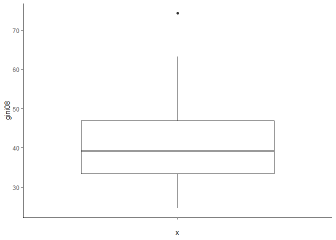
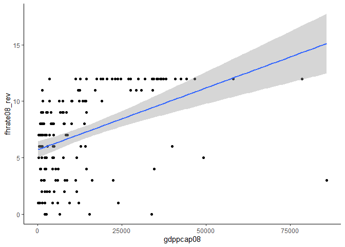

Exercicio 5
================
Lucas Santos Leal

### Carregue o banco de dados `world` que está no pacote `poliscidata`.

``` r
library(poliscidata)
require(ggplot2); theme_set(theme_classic())
require(tidyverse)
if(!require(cowplot)) install.packages("cowplot");require(cowplot)
require(gridExtra)
banco <- world
```

## Existem diversas medidas de democracia para os países: `dem_score14`, `democ11`, `fhrate04_rev`, `fhrate08_rev`, `polity`. Descreva-as graficamente e diga quais são as diferenças entre tais medidas.

#### As variáveis dem\_score14, democ11, fhrate04 e fhrate08 levam valores positivos, variando entre 1.080 e 9.93 (dem\_score14), 0 e 10 (democ11), 1 e 7 (fhrate04\_rev) e 0 e 12 (fhrate08\_rev). Já a variável polity vai de -10 a 10.

``` r
banco <- banco %>% select(dem_score14, democ11, fhrate04_rev,
                          fhrate08_rev, polity, gini08, gdppcap08, oil)
summary(banco)
```

    ##   dem_score14       democ11        fhrate04_rev    fhrate08_rev   
    ##  Min.   :1.080   Min.   : 0.000   Min.   :1.000   Min.   : 0.000  
    ##  1st Qu.:3.610   1st Qu.: 2.000   1st Qu.:2.500   1st Qu.: 4.000  
    ##  Median :5.790   Median : 7.000   Median :5.000   Median : 7.000  
    ##  Mean   :5.548   Mean   : 5.951   Mean   :4.569   Mean   : 7.171  
    ##  3rd Qu.:7.395   3rd Qu.: 9.000   3rd Qu.:6.500   3rd Qu.:11.000  
    ##  Max.   :9.930   Max.   :10.000   Max.   :7.000   Max.   :12.000  
    ##                  NA's   :23       NA's   :14      NA's   :15      
    ##      polity            gini08        gdppcap08          oil          
    ##  Min.   :-10.000   Min.   :24.70   Min.   :  188   Min.   :       0  
    ##  1st Qu.: -0.250   1st Qu.:33.48   1st Qu.: 2179   1st Qu.:       0  
    ##  Median :  7.000   Median :39.10   Median : 7704   Median :    9671  
    ##  Mean   :  4.361   Mean   :40.65   Mean   :13594   Mean   :  512962  
    ##  3rd Qu.:  9.000   3rd Qu.:46.98   3rd Qu.:19663   3rd Qu.:  191000  
    ##  Max.   : 10.000   Max.   :74.30   Max.   :85868   Max.   :10120000  
    ##  NA's   :23        NA's   :45      NA's   :15      NA's   :2

``` r
a <- ggplot(banco, aes(x = "", y = dem_score14)) + geom_boxplot()
a1 <- ggplot(banco,aes(x = dem_score14)) + geom_histogram()
b <- ggplot(banco, aes(x = "", y = democ11)) + geom_boxplot()
b1 <- ggplot(banco, aes(x = democ11)) + geom_histogram()
c <- ggplot(banco, aes(x = "", y = fhrate04_rev)) + geom_boxplot()
c1 <- ggplot(banco, aes(x = fhrate04_rev)) + geom_histogram()
d <- ggplot(banco, aes(x = "", y = fhrate08_rev)) + geom_boxplot()
d1 <- ggplot(banco, aes(x = fhrate08_rev)) + geom_histogram()
e <- ggplot(banco, aes(x = "", y = polity)) + geom_boxplot()
e1 <- ggplot(banco, aes(x = polity)) + geom_histogram()

f1 <- list(a,a1,b,b1,c,c1,d,d1,e,e1)
g <- plot_grid(plotlist = f1, align = 'h', rel_heights = c(1,1), ncol = 4)
g
```

<!-- -->

## Avalie a relação entre todas as medidas de democracia e desigualdade, utilizando a variável `gini08`. Descreva graficamente esta variável, a relação entre as duas variáveis, meça a correlação entre elas e faça regressões lineares (interpretando em profundidade os resultados dos coeficientes e medidas de desempenho dos modelos). Enfatize as semelhanças e diferenças entre os resultados. Quais são suas conclusões?

#### A correlação entre democracia e desigualdade de renda é negativa, resultado encontrado para todas as variáveis de democracia. Para o nível de 95% de confiança, apenas as variáveis dem\_score14 e fhrate04\_rev tiveram valores estatisticamente diferentes de zero, com coeficientes de correlação de -0.21 e -0.17, respectivamente. Aprofundando a análise com as regressões, a significância estatística se repete. A mudança de uma unidade da variável gini08 tem impacto de -0.04 na variável dem\_score14 e de -0.03 na variável fhrate04\_rev. As relações das outras variáveis não podem ser consideradas diferentes de zero à nivel de significância de 95%.

``` r
ggplot(banco, aes(x = gini08)) + geom_histogram()
```

<!-- -->

``` r
ggplot(banco, aes(x = "", y = gini08)) + geom_boxplot()
```

<!-- -->

``` r
## correlações
cor.test(banco$gini08, banco$dem_score14)
```

    ## 
    ##  Pearson's product-moment correlation
    ## 
    ## data:  banco$gini08 and banco$dem_score14
    ## t = -2.4621, df = 120, p-value = 0.01523
    ## alternative hypothesis: true correlation is not equal to 0
    ## 95 percent confidence interval:
    ##  -0.38215203 -0.04321115
    ## sample estimates:
    ##        cor 
    ## -0.2192877

``` r
cor.test(banco$gini08, banco$democ11)
```

    ## 
    ##  Pearson's product-moment correlation
    ## 
    ## data:  banco$gini08 and banco$democ11
    ## t = -0.90439, df = 113, p-value = 0.3677
    ## alternative hypothesis: true correlation is not equal to 0
    ## 95 percent confidence interval:
    ##  -0.26378781  0.09988899
    ## sample estimates:
    ##         cor 
    ## -0.08477203

``` r
cor.test(banco$gini08, banco$fhrate04_rev)
```

    ## 
    ##  Pearson's product-moment correlation
    ## 
    ## data:  banco$gini08 and banco$fhrate04_rev
    ## t = -1.9869, df = 120, p-value = 0.04921
    ## alternative hypothesis: true correlation is not equal to 0
    ## 95 percent confidence interval:
    ##  -0.3452745300 -0.0007294745
    ## sample estimates:
    ##        cor 
    ## -0.1784673

``` r
cor.test(banco$gini08, banco$fhrate08_rev)
```

    ## 
    ##  Pearson's product-moment correlation
    ## 
    ## data:  banco$gini08 and banco$fhrate08_rev
    ## t = -1.7432, df = 119, p-value = 0.08387
    ## alternative hypothesis: true correlation is not equal to 0
    ## 95 percent confidence interval:
    ##  -0.32708386  0.02129614
    ## sample estimates:
    ##        cor 
    ## -0.1578002

``` r
cor.test(banco$gini08, banco$polity)
```

    ## 
    ##  Pearson's product-moment correlation
    ## 
    ## data:  banco$gini08 and banco$polity
    ## t = -0.43417, df = 113, p-value = 0.665
    ## alternative hypothesis: true correlation is not equal to 0
    ## 95 percent confidence interval:
    ##  -0.2222590  0.1433725
    ## sample estimates:
    ##         cor 
    ## -0.04080936

``` r
## regressões e gráficos (VI = democracia, VD = desigualdade)
summary(lm(dem_score14~gini08, data = banco)) ## dem_score14
```

    ## 
    ## Call:
    ## lm(formula = dem_score14 ~ gini08, data = banco)
    ## 
    ## Residuals:
    ##     Min      1Q  Median      3Q     Max 
    ## -4.0728 -1.7583  0.3513  1.6742  3.3600 
    ## 
    ## Coefficients:
    ##             Estimate Std. Error t value Pr(>|t|)    
    ## (Intercept)  7.71756    0.75639  10.203   <2e-16 ***
    ## gini08      -0.04448    0.01807  -2.462   0.0152 *  
    ## ---
    ## Signif. codes:  0 '***' 0.001 '**' 0.01 '*' 0.05 '.' 0.1 ' ' 1
    ## 
    ## Residual standard error: 2.003 on 120 degrees of freedom
    ##   (45 observations deleted due to missingness)
    ## Multiple R-squared:  0.04809,    Adjusted R-squared:  0.04015 
    ## F-statistic: 6.062 on 1 and 120 DF,  p-value: 0.01523

``` r
ggplot(banco, aes(y = dem_score14, x = gini08)) + geom_point() + geom_smooth(method = 'lm')
```

<!-- -->

``` r
summary(lm(democ11~gini08, data = banco)) ## democ11
```

    ## 
    ## Call:
    ## lm(formula = democ11 ~ gini08, data = banco)
    ## 
    ## Residuals:
    ##    Min     1Q Median     3Q    Max 
    ## -6.796 -2.213  1.302  3.049  3.958 
    ## 
    ## Coefficients:
    ##             Estimate Std. Error t value Pr(>|t|)    
    ## (Intercept)  7.68568    1.38306   5.557 1.85e-07 ***
    ## gini08      -0.02994    0.03311  -0.904    0.368    
    ## ---
    ## Signif. codes:  0 '***' 0.001 '**' 0.01 '*' 0.05 '.' 0.1 ' ' 1
    ## 
    ## Residual standard error: 3.47 on 113 degrees of freedom
    ##   (52 observations deleted due to missingness)
    ## Multiple R-squared:  0.007186,   Adjusted R-squared:  -0.0016 
    ## F-statistic: 0.8179 on 1 and 113 DF,  p-value: 0.3677

``` r
ggplot(banco, aes(y = democ11, x = gini08)) + geom_point() + geom_smooth(method = 'lm')
```

<!-- -->

``` r
summary(lm(fhrate04_rev~gini08, data = banco)) ## fhrate04_rev
```

    ## 
    ## Call:
    ## lm(formula = fhrate04_rev ~ gini08, data = banco)
    ## 
    ## Residuals:
    ##     Min      1Q  Median      3Q     Max 
    ## -3.8312 -1.3896  0.4312  1.6729  2.6199 
    ## 
    ## Coefficients:
    ##             Estimate Std. Error t value Pr(>|t|)    
    ## (Intercept)  6.13654    0.67419   9.102 2.35e-15 ***
    ## gini08      -0.03199    0.01610  -1.987   0.0492 *  
    ## ---
    ## Signif. codes:  0 '***' 0.001 '**' 0.01 '*' 0.05 '.' 0.1 ' ' 1
    ## 
    ## Residual standard error: 1.786 on 120 degrees of freedom
    ##   (45 observations deleted due to missingness)
    ## Multiple R-squared:  0.03185,    Adjusted R-squared:  0.02378 
    ## F-statistic: 3.948 on 1 and 120 DF,  p-value: 0.04921

``` r
ggplot(banco, aes(y = fhrate04_rev, x = gini08)) + geom_point() + geom_smooth(method = 'lm')
```

<!-- -->

``` r
summary(lm(fhrate08_rev~gini08, data = banco)) ## fhrate08_rev
```

    ## 
    ## Call:
    ## lm(formula = fhrate08_rev ~ gini08, data = banco)
    ## 
    ## Residuals:
    ##     Min      1Q  Median      3Q     Max 
    ## -7.9157 -2.5971  0.6712  3.4091  5.0961 
    ## 
    ## Coefficients:
    ##             Estimate Std. Error t value Pr(>|t|)    
    ## (Intercept)  9.97288    1.34188   7.432 1.79e-11 ***
    ## gini08      -0.05590    0.03207  -1.743   0.0839 .  
    ## ---
    ## Signif. codes:  0 '***' 0.001 '**' 0.01 '*' 0.05 '.' 0.1 ' ' 1
    ## 
    ## Residual standard error: 3.554 on 119 degrees of freedom
    ##   (46 observations deleted due to missingness)
    ## Multiple R-squared:  0.0249, Adjusted R-squared:  0.01671 
    ## F-statistic: 3.039 on 1 and 119 DF,  p-value: 0.08387

``` r
ggplot(banco, aes(y = fhrate08_rev, x = gini08)) + geom_point() + geom_smooth(method = 'lm')
```

<!-- -->

``` r
summary(lm(polity~gini08, data = banco)) ## polity
```

    ## 
    ## Call:
    ## lm(formula = polity ~ gini08, data = banco)
    ## 
    ## Residuals:
    ##     Min      1Q  Median      3Q     Max 
    ## -14.374  -1.300   2.364   4.087   5.040 
    ## 
    ## Coefficients:
    ##             Estimate Std. Error t value Pr(>|t|)   
    ## (Intercept)  6.21813    2.20594   2.819  0.00569 **
    ## gini08      -0.02292    0.05280  -0.434  0.66499   
    ## ---
    ## Signif. codes:  0 '***' 0.001 '**' 0.01 '*' 0.05 '.' 0.1 ' ' 1
    ## 
    ## Residual standard error: 5.535 on 113 degrees of freedom
    ##   (52 observations deleted due to missingness)
    ## Multiple R-squared:  0.001665,   Adjusted R-squared:  -0.007169 
    ## F-statistic: 0.1885 on 1 and 113 DF,  p-value: 0.665

``` r
ggplot(banco, aes(y = polity, x = gini08)) + geom_point() + geom_smooth(method = 'lm')
```

<!-- -->

## Avalie a relação entre todas as medidas de democracia e crescimento econômico, utilizando a variável `gdppcap08`. Descreva graficamente esta variável, a relação entre as duas variáveis, meça a correlação entre elas e faça regressões lineares (interpretando em profundidade os resultados dos coeficientes e medidas de desempenho dos modelos). Enfatize as semelhanças e diferenças entre os resultados. Quais são suas conclusões?

#### Diferentemente do que ocorre com o índice de Gini, todas as variáveis de democracia possuem resultados estatisticamente significativos quando relacionados com crescimento econômico. A relação encontrada é positiva, indicando que ser democrático, ou quanto mais democrático um país, maior seu desenvolvimento econômico. A variável com maior correlação foi dem\_score14, com coeficiênte de 0.50, seguida por fhrate08\_rev (0.444) e fhrate04\_rev (0.440). Todas as variáveis obtiveram valores significativos de seus coeficientes, no entanto, o impacto da mudança de uma unidade do pib per capta tem impacto pequeno nas variáveis de democracia. Neste caso, o mais apropriado poderia ser utilizar o log do pib per capta.

``` r
ggplot(banco, aes(x = gdppcap08)) + geom_histogram()
```

<!-- -->

``` r
ggplot(banco, aes(x = "", y = gdppcap08)) + geom_boxplot()
```

<!-- -->

``` r
## correlações
cor.test(banco$gdppcap08, banco$dem_score14)
```

    ## 
    ##  Pearson's product-moment correlation
    ## 
    ## data:  banco$gdppcap08 and banco$dem_score14
    ## t = 7.1713, df = 150, p-value = 3.159e-11
    ## alternative hypothesis: true correlation is not equal to 0
    ## 95 percent confidence interval:
    ##  0.3763618 0.6150148
    ## sample estimates:
    ##       cor 
    ## 0.5052872

``` r
cor.test(banco$gdppcap08, banco$democ11)
```

    ## 
    ##  Pearson's product-moment correlation
    ## 
    ## data:  banco$gdppcap08 and banco$democ11
    ## t = 3.6037, df = 140, p-value = 0.000435
    ## alternative hypothesis: true correlation is not equal to 0
    ## 95 percent confidence interval:
    ##  0.1330147 0.4351981
    ## sample estimates:
    ##      cor 
    ## 0.291358

``` r
cor.test(banco$gdppcap08, banco$fhrate04_rev)
```

    ## 
    ##  Pearson's product-moment correlation
    ## 
    ## data:  banco$gdppcap08 and banco$fhrate04_rev
    ## t = 6.0129, df = 150, p-value = 1.331e-08
    ## alternative hypothesis: true correlation is not equal to 0
    ## 95 percent confidence interval:
    ##  0.3027442 0.5605748
    ## sample estimates:
    ##       cor 
    ## 0.4407043

``` r
cor.test(banco$gdppcap08, banco$fhrate08_rev)
```

    ## 
    ##  Pearson's product-moment correlation
    ## 
    ## data:  banco$gdppcap08 and banco$fhrate08_rev
    ## t = 6.0508, df = 149, p-value = 1.115e-08
    ## alternative hypothesis: true correlation is not equal to 0
    ## 95 percent confidence interval:
    ##  0.3061176 0.5638582
    ## sample estimates:
    ##     cor 
    ## 0.44413

``` r
cor.test(banco$gdppcap08, banco$polity)
```

    ## 
    ##  Pearson's product-moment correlation
    ## 
    ## data:  banco$gdppcap08 and banco$polity
    ## t = 2.0332, df = 140, p-value = 0.04392
    ## alternative hypothesis: true correlation is not equal to 0
    ## 95 percent confidence interval:
    ##  0.004758504 0.325013386
    ## sample estimates:
    ##      cor 
    ## 0.169353

``` r
## regressões e gráficos
summary(lm(dem_score14~gdppcap08, data = banco)) ## dem_score14
```

    ## 
    ## Call:
    ## lm(formula = dem_score14 ~ gdppcap08, data = banco)
    ## 
    ## Residuals:
    ##     Min      1Q  Median      3Q     Max 
    ## -7.5428 -1.3420  0.6982  1.2843  3.0329 
    ## 
    ## Coefficients:
    ##              Estimate Std. Error t value Pr(>|t|)    
    ## (Intercept) 4.678e+00  2.017e-01  23.197  < 2e-16 ***
    ## gdppcap08   7.040e-05  9.817e-06   7.171 3.16e-11 ***
    ## ---
    ## Signif. codes:  0 '***' 0.001 '**' 0.01 '*' 0.05 '.' 0.1 ' ' 1
    ## 
    ## Residual standard error: 1.864 on 150 degrees of freedom
    ##   (15 observations deleted due to missingness)
    ## Multiple R-squared:  0.2553, Adjusted R-squared:  0.2504 
    ## F-statistic: 51.43 on 1 and 150 DF,  p-value: 3.159e-11

``` r
ggplot(banco, aes(y = dem_score14, x = gdppcap08)) + geom_point() + geom_smooth(method = 'lm')
```

<!-- -->

``` r
summary(lm(democ11~gdppcap08, data = banco)) ## democ11
```

    ## 
    ## Call:
    ## lm(formula = democ11 ~ gdppcap08, data = banco)
    ## 
    ## Residuals:
    ##     Min      1Q  Median      3Q     Max 
    ## -11.258  -3.030   1.723   2.783   4.803 
    ## 
    ## Coefficients:
    ##              Estimate Std. Error t value Pr(>|t|)    
    ## (Intercept) 4.939e+00  4.026e-01  12.270  < 2e-16 ***
    ## gdppcap08   7.359e-05  2.042e-05   3.604 0.000435 ***
    ## ---
    ## Signif. codes:  0 '***' 0.001 '**' 0.01 '*' 0.05 '.' 0.1 ' ' 1
    ## 
    ## Residual standard error: 3.57 on 140 degrees of freedom
    ##   (25 observations deleted due to missingness)
    ## Multiple R-squared:  0.08489,    Adjusted R-squared:  0.07835 
    ## F-statistic: 12.99 on 1 and 140 DF,  p-value: 0.000435

``` r
ggplot(banco, aes(y = democ11, x = gdppcap08)) + geom_point() + geom_smooth(method = 'lm')
```

<!-- -->

``` r
summary(lm(fhrate04_rev~gdppcap08, data = banco)) ## fhrate04_rev
```

    ## 
    ## Call:
    ## lm(formula = fhrate04_rev ~ gdppcap08, data = banco)
    ## 
    ## Residuals:
    ##     Min      1Q  Median      3Q     Max 
    ## -6.0897 -1.4154  0.5914  1.2481  2.9773 
    ## 
    ## Coefficients:
    ##              Estimate Std. Error t value Pr(>|t|)    
    ## (Intercept) 3.828e+00  1.894e-01  20.210  < 2e-16 ***
    ## gdppcap08   5.545e-05  9.222e-06   6.013 1.33e-08 ***
    ## ---
    ## Signif. codes:  0 '***' 0.001 '**' 0.01 '*' 0.05 '.' 0.1 ' ' 1
    ## 
    ## Residual standard error: 1.751 on 150 degrees of freedom
    ##   (15 observations deleted due to missingness)
    ## Multiple R-squared:  0.1942, Adjusted R-squared:  0.1888 
    ## F-statistic: 36.16 on 1 and 150 DF,  p-value: 1.331e-08

``` r
ggplot(banco, aes(y = fhrate04_rev, x = gdppcap08)) + geom_point() + geom_smooth(method = 'lm')
```

<!-- -->

``` r
summary(lm(fhrate08_rev~gdppcap08, data = banco)) ## fhrate08_rev
```

    ## 
    ## Call:
    ## lm(formula = fhrate08_rev ~ gdppcap08, data = banco)
    ## 
    ## Residuals:
    ##     Min      1Q  Median      3Q     Max 
    ## -12.124  -2.345   1.164   2.510   5.918 
    ## 
    ## Coefficients:
    ##              Estimate Std. Error t value Pr(>|t|)    
    ## (Intercept) 5.698e+00  3.739e-01  15.237  < 2e-16 ***
    ## gdppcap08   1.098e-04  1.814e-05   6.051 1.11e-08 ***
    ## ---
    ## Signif. codes:  0 '***' 0.001 '**' 0.01 '*' 0.05 '.' 0.1 ' ' 1
    ## 
    ## Residual standard error: 3.438 on 149 degrees of freedom
    ##   (16 observations deleted due to missingness)
    ## Multiple R-squared:  0.1973, Adjusted R-squared:  0.1919 
    ## F-statistic: 36.61 on 1 and 149 DF,  p-value: 1.115e-08

``` r
ggplot(banco, aes(y = fhrate08_rev, x = gdppcap08)) + geom_point() + geom_smooth(method = 'lm')
```

<!-- -->

``` r
summary(lm(polity~gdppcap08, data = banco)) ## polity
```

    ## 
    ## Call:
    ## lm(formula = polity ~ gdppcap08, data = banco)
    ## 
    ## Residuals:
    ##     Min      1Q  Median      3Q     Max 
    ## -19.426  -4.207   2.847   4.332   6.378 
    ## 
    ## Coefficients:
    ##              Estimate Std. Error t value Pr(>|t|)    
    ## (Intercept) 3.375e+00  6.833e-01   4.940  2.2e-06 ***
    ## gdppcap08   7.047e-05  3.466e-05   2.033   0.0439 *  
    ## ---
    ## Signif. codes:  0 '***' 0.001 '**' 0.01 '*' 0.05 '.' 0.1 ' ' 1
    ## 
    ## Residual standard error: 6.059 on 140 degrees of freedom
    ##   (25 observations deleted due to missingness)
    ## Multiple R-squared:  0.02868,    Adjusted R-squared:  0.02174 
    ## F-statistic: 4.134 on 1 and 140 DF,  p-value: 0.04392

``` r
ggplot(banco, aes(y = polity, x = gdppcap08)) + geom_point() + geom_smooth(method = 'lm')
```

<!-- -->

## Avalie a relação entre todas as medidas de democracia e produção de petróleo, utilizando a variável `oil`. Descreva graficamente esta variável, a relação entre as duas variáveis, meça a correlação entre elas e faça regressões lineares (interpretando em profundidade os resultados dos coeficientes e medidas de desempenho dos modelos). Enfatize as semelhanças e diferenças entre os resultados. Quais são suas conclusões?

#### Os dados indicam uma relação negativa entre democracia e produção de petróleo, no entanto, apenas a relação com a variável polity foi significativa.

``` r
ggplot(banco, aes(x = oil)) + geom_histogram()
```

<!-- -->

``` r
ggplot(banco, aes(x = "", y = oil)) + geom_boxplot()
```

<!-- -->

``` r
## correlações
cor.test(banco$oil, banco$dem_score14)
```

    ## 
    ##  Pearson's product-moment correlation
    ## 
    ## data:  banco$oil and banco$dem_score14
    ## t = -1.6344, df = 163, p-value = 0.1041
    ## alternative hypothesis: true correlation is not equal to 0
    ## 95 percent confidence interval:
    ##  -0.27443572  0.02631799
    ## sample estimates:
    ##        cor 
    ## -0.1269762

``` r
cor.test(banco$oil, banco$democ11)
```

    ## 
    ##  Pearson's product-moment correlation
    ## 
    ## data:  banco$oil and banco$democ11
    ## t = -1.718, df = 142, p-value = 0.08798
    ## alternative hypothesis: true correlation is not equal to 0
    ## 95 percent confidence interval:
    ##  -0.29928445  0.02138076
    ## sample estimates:
    ##        cor 
    ## -0.1426942

``` r
cor.test(banco$oil, banco$fhrate04_rev)
```

    ## 
    ##  Pearson's product-moment correlation
    ## 
    ## data:  banco$oil and banco$fhrate04_rev
    ## t = -1.9244, df = 150, p-value = 0.0562
    ## alternative hypothesis: true correlation is not equal to 0
    ## 95 percent confidence interval:
    ##  -0.306837012  0.004083069
    ## sample estimates:
    ##        cor 
    ## -0.1552185

``` r
cor.test(banco$oil, banco$fhrate08_rev)
```

    ## 
    ##  Pearson's product-moment correlation
    ## 
    ## data:  banco$oil and banco$fhrate08_rev
    ## t = -1.8779, df = 149, p-value = 0.06235
    ## alternative hypothesis: true correlation is not equal to 0
    ## 95 percent confidence interval:
    ##  -0.304387817  0.007867529
    ## sample estimates:
    ##       cor 
    ## -0.152052

``` r
cor.test(banco$oil, banco$polity)
```

    ## 
    ##  Pearson's product-moment correlation
    ## 
    ## data:  banco$oil and banco$polity
    ## t = -2.195, df = 142, p-value = 0.02979
    ## alternative hypothesis: true correlation is not equal to 0
    ## 95 percent confidence interval:
    ##  -0.33480603 -0.01811182
    ## sample estimates:
    ##        cor 
    ## -0.1811511

``` r
## regressões e gráficos
summary(lm(dem_score14~oil, data = banco)) ## dem_score14
```

    ## 
    ## Call:
    ## lm(formula = dem_score14 ~ oil, data = banco)
    ## 
    ## Residuals:
    ##    Min     1Q Median     3Q    Max 
    ## -4.574 -1.934  0.144  1.797  4.718 
    ## 
    ## Coefficients:
    ##               Estimate Std. Error t value Pr(>|t|)    
    ## (Intercept)  5.654e+00  1.795e-01  31.503   <2e-16 ***
    ## oil         -1.881e-07  1.151e-07  -1.634    0.104    
    ## ---
    ## Signif. codes:  0 '***' 0.001 '**' 0.01 '*' 0.05 '.' 0.1 ' ' 1
    ## 
    ## Residual standard error: 2.177 on 163 degrees of freedom
    ##   (2 observations deleted due to missingness)
    ## Multiple R-squared:  0.01612,    Adjusted R-squared:  0.01009 
    ## F-statistic: 2.671 on 1 and 163 DF,  p-value: 0.1041

``` r
ggplot(banco, aes(y = dem_score14, x = oil)) + geom_point() + geom_smooth(method = 'lm')
```

<!-- -->

``` r
summary(lm(democ11~oil, data = banco)) ## democ11
```

    ## 
    ## Call:
    ## lm(formula = democ11 ~ oil, data = banco)
    ## 
    ## Residuals:
    ##     Min      1Q  Median      3Q     Max 
    ## -6.1387 -3.2230  0.8616  2.8893  6.9421 
    ## 
    ## Coefficients:
    ##               Estimate Std. Error t value Pr(>|t|)    
    ## (Intercept)  6.139e+00  3.259e-01  18.837   <2e-16 ***
    ## oil         -3.402e-07  1.980e-07  -1.718    0.088 .  
    ## ---
    ## Signif. codes:  0 '***' 0.001 '**' 0.01 '*' 0.05 '.' 0.1 ' ' 1
    ## 
    ## Residual standard error: 3.685 on 142 degrees of freedom
    ##   (23 observations deleted due to missingness)
    ## Multiple R-squared:  0.02036,    Adjusted R-squared:  0.01346 
    ## F-statistic: 2.951 on 1 and 142 DF,  p-value: 0.08798

``` r
ggplot(banco, aes(y = democ11, x = oil)) + geom_point() + geom_smooth(method = 'lm')
```

<!-- -->

``` r
summary(lm(fhrate04_rev~oil, data = banco)) ## fhrate04_rev
```

    ## 
    ## Call:
    ## lm(formula = fhrate04_rev ~ oil, data = banco)
    ## 
    ## Residuals:
    ##     Min      1Q  Median      3Q     Max 
    ## -3.6658 -1.7613  0.3246  1.8334  4.1268 
    ## 
    ## Coefficients:
    ##               Estimate Std. Error t value Pr(>|t|)    
    ## (Intercept)  4.675e+00  1.663e-01  28.109   <2e-16 ***
    ## oil         -1.990e-07  1.034e-07  -1.924   0.0562 .  
    ## ---
    ## Signif. codes:  0 '***' 0.001 '**' 0.01 '*' 0.05 '.' 0.1 ' ' 1
    ## 
    ## Residual standard error: 1.934 on 150 degrees of freedom
    ##   (15 observations deleted due to missingness)
    ## Multiple R-squared:  0.02409,    Adjusted R-squared:  0.01759 
    ## F-statistic: 3.703 on 1 and 150 DF,  p-value: 0.0562

``` r
ggplot(banco, aes(y = fhrate04_rev, x = oil)) + geom_point() + geom_smooth(method = 'lm')
```

<!-- -->

``` r
summary(lm(fhrate08_rev~oil, data = banco)) ## fhrate08_rev
```

    ## 
    ## Call:
    ## lm(formula = fhrate08_rev ~ oil, data = banco)
    ## 
    ## Residuals:
    ##     Min      1Q  Median      3Q     Max 
    ## -7.3506 -3.3777 -0.3643  3.6243  8.0856 
    ## 
    ## Coefficients:
    ##               Estimate Std. Error t value Pr(>|t|)    
    ## (Intercept)  7.378e+00  3.286e-01  22.449   <2e-16 ***
    ## oil         -3.824e-07  2.037e-07  -1.878   0.0624 .  
    ## ---
    ## Signif. codes:  0 '***' 0.001 '**' 0.01 '*' 0.05 '.' 0.1 ' ' 1
    ## 
    ## Residual standard error: 3.808 on 149 degrees of freedom
    ##   (16 observations deleted due to missingness)
    ## Multiple R-squared:  0.02312,    Adjusted R-squared:  0.01656 
    ## F-statistic: 3.526 on 1 and 149 DF,  p-value: 0.06235

``` r
ggplot(banco, aes(y = fhrate08_rev, x = oil)) + geom_point() + geom_smooth(method = 'lm')
```

<!-- -->

``` r
summary(lm(polity~oil, data = banco)) ## polity
```

    ## 
    ## Call:
    ## lm(formula = polity ~ oil, data = banco)
    ## 
    ## Residuals:
    ##     Min      1Q  Median      3Q     Max 
    ## -13.890  -4.906   2.248   4.505  11.681 
    ## 
    ## Coefficients:
    ##               Estimate Std. Error t value Pr(>|t|)    
    ## (Intercept)  4.752e+00  5.327e-01   8.922 2.09e-15 ***
    ## oil         -7.105e-07  3.237e-07  -2.195   0.0298 *  
    ## ---
    ## Signif. codes:  0 '***' 0.001 '**' 0.01 '*' 0.05 '.' 0.1 ' ' 1
    ## 
    ## Residual standard error: 6.024 on 142 degrees of freedom
    ##   (23 observations deleted due to missingness)
    ## Multiple R-squared:  0.03282,    Adjusted R-squared:  0.026 
    ## F-statistic: 4.818 on 1 and 142 DF,  p-value: 0.02979

``` r
ggplot(banco, aes(y = polity, x = oil)) + geom_point() + geom_smooth(method = 'lm')
```

<!-- -->

## Avalie a relação entre crescimento econômico e produção de petróleo. Descreva a relação entre as duas variáveis, meça a correlação entre elas e faça regressões lineares (interpretando em profundidade os resultados dos coeficientes e medidas de desempenho dos modelos). Enfatize as semelhanças e diferenças entre os resultados. Quais são suas conclusões?

#### Os dados mostram uma relação positiva entre produção de petróleo e a variável de PIB per capta. O coeficiente de correlação entre as variáveis foi de 0.18, o que indica uma correlação baixa, mas com valor significativo ao nível de 0.05. A regressão com os dados brutos de produção de petróleo indicam que o aumento unitário nesta variável implica num aumento de 0.0001884 na renda per capta. Para facilitar a compreensão, a regressão com o log da produção de petróleo indica que um aumento de 1% na produção gera um aumento de 837 na renda per capta. Para as duas regressões os coeficientes são diferentes de zero no nível de confiança de 95%.

``` r
cor.test(banco$gdppcap08, banco$oil)
```

    ## 
    ##  Pearson's product-moment correlation
    ## 
    ## data:  banco$gdppcap08 and banco$oil
    ## t = 2.3051, df = 149, p-value = 0.02254
    ## alternative hypothesis: true correlation is not equal to 0
    ## 95 percent confidence interval:
    ##  0.02661893 0.33534756
    ## sample estimates:
    ##       cor 
    ## 0.1855584

``` r
summary(lm(gdppcap08~oil, banco))
```

    ## 
    ## Call:
    ## lm(formula = gdppcap08 ~ oil, data = banco)
    ## 
    ## Residuals:
    ##    Min     1Q Median     3Q    Max 
    ## -15541 -10735  -6347   6549  70967 
    ## 
    ## Coefficients:
    ##              Estimate Std. Error t value Pr(>|t|)    
    ## (Intercept) 1.262e+04  1.319e+03   9.566   <2e-16 ***
    ## oil         1.884e-03  8.173e-04   2.305   0.0225 *  
    ## ---
    ## Signif. codes:  0 '***' 0.001 '**' 0.01 '*' 0.05 '.' 0.1 ' ' 1
    ## 
    ## Residual standard error: 15280 on 149 degrees of freedom
    ##   (16 observations deleted due to missingness)
    ## Multiple R-squared:  0.03443,    Adjusted R-squared:  0.02795 
    ## F-statistic: 5.313 on 1 and 149 DF,  p-value: 0.02254

``` r
ggplot(banco, aes(x = oil, y = gdppcap08)) + geom_point() + geom_smooth(method = 'lm')
```

<!-- -->

## A partir das suas conclusões sobre a relação entre democracia, economia e produção de petróleo, quais considerações são possíveis fazer sobre a relação CAUSAL entre estas variáveis? Lembre dos 4 “hurdles” do livro *Fundamentals of Political Science Research*

#### Primeiramente, deve-se debater se há mecanismos causais críveis entre as variáveis. Se considerarmos que a desigualdade de renda como um determinante da democracia, é possível considerar que em países com menor desigualdade, ou em que a desigualdade esteja diminuindo, as pessoas de baixa renda estejam ganhando ou já possuem acesso ao direitos políticos, sociais e civis, portanto fortalecendo a democracia ou gerando pressão para que ela surja. A segunda variável, renda per capta, também apresenta um mecanismo causal crível. Países que possuem uma renda per capta maior tem maior capacidade de fornecer aos cidadãos acesso aos serviçõs mínimos de qualidade de vida como saúde, educação e segurança. Uma renda per capta maior também pode ser sinalizadora de que as riquezas estejam distribuídas na sociedade, ainda que haja outliers nesse sentido. Por fim, a relação entre produção de petróleo e democracia é mais frágil, mas pode-se argumentar que a existência de uma riqueza natural como o petróleo pode ser um fator de desenvolvimento econômico, o que daria maior capacidade de um país em desenvolver suas instituições e sua democracia. O segundo ‘hurdle’ se refere à possibilidade de causação reversa. É possível que haja dupla causalidade entre desigualdade e democracia, assim como entre pib per capta e democracia. Afinal, países democráticom têm como valores a redução das desigualdades o que, por consequência pode gerar desenvolvimento econômico. Portanto, é necessário seguir com cautela ao passo três, que trata da covariação. Como foi demonstrado através dos testes de correlação, a covariação entre democracia e pib per capta é a mais significativa. Quanto relacionada com o índice de gini, as correlações foram em sua maioria fracas, e em apenas duas delas o p-valor foi significativo. A produção de petróleo foi a variável com menor covariação encontrada, pois apenas um de seus índices pôde ser considerado diferente de zero, estatisticamente. O último ‘hurdle’ se refere a outros fatores que também podem influenciar a variável dependente. Neste caso, todas as regressões sofrem com a possibilidade de que outras variáveis sejam intervenientes, afinal democracia é um conceito amplo e bastante variável, que é determinado por diversos fatores.
