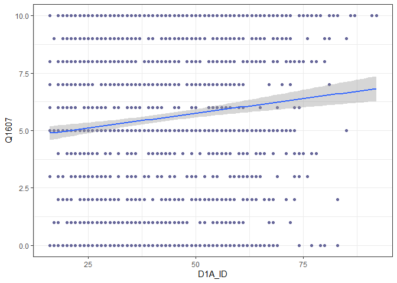

Exercicio 6
================
Lucas Santos Leal de Albuquerque

### Neste exercício usaremos o banco de dados do ESEB 2018. Para maiores detalhes sobre o survey, ver neste [link](https://www.cesop.unicamp.br/por/eseb). O questionário da pesquisa de 2018 está [aqui](https://www.cesop.unicamp.br/vw/1IMr0S64wNQ_MDA_91ea3_/quest_04622.pdf) e pode ser consultado para ter maiores detalhes sobre as variáveis.

### O banco de dados está disponível no site do CESOP para usuários cadastrados. Para facilitar o acesso, deixei o banco de dados dispónivel no seguinte endereço: <https://github.com/MartinsRodrigo/Analise-de-dados/raw/master/04622.sav>

### Baixe o banco de dados pelo R

``` r
Url <- 'https://github.com/MartinsRodrigo/Analise-de-dados/raw/master/04622.sav'
banco <- read_sav(url(Url))       
### O banco foi feito em SPSS e está em formato SAV. Carregue-o

### Utilize as funções para observar o banco de dados
glimpse(banco)
```

    ## Rows: 2,506
    ## Columns: 286
    ## $ A1_Nquest           <dbl> 1, 2, 3, 4, 5, 6, 7, 8, 9, 10, 11, 12, 13, 14, ...
    ## $ DIAENTR             <dbl> 15, 15, 15, 16, 16, 16, 16, 17, 17, 17, 17, 17,...
    ## $ MESENTR             <dbl+lbl> 11, 11, 11, 11, 11, 11, 11, 11, 11, 11, 11,...
    ## $ ANOENTR             <dbl> 2018, 2018, 2018, 2018, 2018, 2018, 2018, 2018,...
    ## $ D1A_ID              <dbl> 41, 23, 21, 39, 64, 45, 18, 29, 25, 31, 23, 45,...
    ## $ D1A_FAIXAID         <dbl+lbl> 4, 2, 2, 4, 6, 5, 2, 3, 3, 3, 2, 5, 6, 3, 6...
    ## $ D2_SEXO             <dbl+lbl> 2, 1, 2, 1, 1, 2, 2, 1, 2, 1, 1, 1, 2, 2, 1...
    ## $ D3_ESCOLA           <dbl+lbl> 5, 5, 6, 3, 0, 0, 4, 8, 8, 6, 2, 2, 1, 2, 6...
    ## $ RAMOATIV            <dbl+lbl>  6,  4, 10,  3,  1,  7, 10,  5,  4,  7, 10,...
    ## $ RAMOCHEFEF          <dbl+lbl> 99, 99, 99, 99, 99, 99, 99, 99, 99, 99, 99,...
    ## $ OCUPA               <dbl+lbl> 2, 1, 4, 3, 3, 1, 4, 2, 1, 1, 4, 4, 4, 4, 3...
    ## $ UF                  <dbl+lbl> 12, 12, 12, 12, 12, 12, 12, 12, 12, 12, 12,...
    ## $ CID                 <dbl+lbl> 1, 1, 1, 1, 1, 1, 1, 1, 1, 1, 1, 1, 1, 1, 2...
    ## $ REG                 <dbl+lbl> 1, 1, 1, 1, 1, 1, 1, 1, 1, 1, 1, 1, 1, 1, 1...
    ## $ Q1                  <dbl+lbl> 4, 4, 4, 4, 1, 4, 4, 3, 4, 2, 3, 3, 3, 4, 3...
    ## $ Q2                  <dbl+lbl> 3, 3, 4, 3, 4, 3, 4, 3, 4, 2, 3, 3, 4, 4, 3...
    ## $ Q3                  <dbl+lbl> 2, 3, 3, 2, 1, 2, 4, 2, 4, 1, 5, 2, 3, 5, 1...
    ## $ Q401                <dbl+lbl> 3, 2, 5, 1, 4, 2, 2, 1, 2, 3, 4, 1, 2, 1, 1...
    ## $ Q402                <dbl+lbl> 1, 1, 3, 1, 1, 1, 1, 1, 1, 1, 1, 1, 1, 2, 1...
    ## $ Q403                <dbl+lbl> 5, 1, 5, 3, 5, 3, 5, 5, 1, 5, 4, 5, 2, 5, 5...
    ## $ Q404                <dbl+lbl> 1, 1, 1, 1, 1, 1, 2, 1, 1, 1, 4, 1, 3, 1, 1...
    ## $ Q405                <dbl+lbl> 3, 3, 3, 1, 1, 3, 4, 5, 1, 5, 2, 2, 5, 5, 1...
    ## $ Q406                <dbl+lbl> 1, 1, 3, 1, 4, 1, 2, 1, 2, 1, 1, 1, 2, 1, 4...
    ## $ Q407                <dbl+lbl> 1, 1, 1, 1, 1, 1, 1, 1, 1, 1, 1, 1, 1, 1, 1...
    ## $ Q501                <dbl+lbl> 3, 3, 3, 3, 4, 2, 4, 1, 2, 2, 2, 5, 3, 1, 1...
    ## $ Q502                <dbl+lbl> 1, 4, 2, 2, 2, 4, 3, 1, 1, 1, 5, 5, 2, 3, 5...
    ## $ Q503                <dbl+lbl> 2, 2, 1, 3, 1, 8, 3, 5, 2, 2, 2, 5, 3, 2, 5...
    ## $ Q504                <dbl+lbl> 3, 5, 1, 3, 3, 2, 5, 1, 4, 4, 4, 1, 3, 1, 1...
    ## $ Q505                <dbl+lbl> 3, 3, 3, 3, 4, 5, 4, 1, 5, 4, 5, 4, 3, 1, 1...
    ## $ Q601                <dbl+lbl> 1, 1, 1, 1, 1, 1, 4, 4, 2, 1, 3, 1, 2, 4, 1...
    ## $ Q602                <dbl+lbl> 1, 3, 1, 3, 3, 1, 2, 1, 1, 3, 1, 2, 4, 3, 1...
    ## $ Q603                <dbl+lbl> 1, 3, 1, 1, 1, 1, 3, 1, 1, 2, 2, 3, 3, 4, 1...
    ## $ Q604                <dbl+lbl> 1, 2, 2, 1, 1, 1, 1, 1, 2, 1, 1, 1, 4, 2, 1...
    ## $ Q7                  <dbl+lbl> 1, 1, 1, 1, 1, 1, 1, 1, 1, 1, 1, 1, 2, 3, 4...
    ## $ Q8                  <dbl+lbl> 1, 2, 3, 2, 1, 1, 3, 1, 1, 1, 1, 1, 3, 1, 1...
    ## $ Q9                  <dbl+lbl> 5, 5, 5, 5, 5, 5, 5, 5, 4, 5, 4, 5, 4, 5, 5...
    ## $ Q10A                <dbl+lbl> 5, 5, 5, 1, 1, 5, 5, 1, 5, 5, 5, 5, 5, 5, 5...
    ## $ Q10B                <dbl+lbl> 99, 99, 99, 17, 13, 99, 99, 17, 99, 99, 99,...
    ## $ Q11                 <dbl+lbl> 5, 3, 5, 5, 5, 5, 5, 5, 5, 4, 4, 4, 3, 5, 5...
    ## $ Q12P1_A             <dbl+lbl> 1, 1, 1, 1, 1, 1, 1, 1, 1, 7, 6, 1, 1, 1, 1...
    ## $ Q12P1_B             <dbl+lbl>  9,  9,  9,  9,  9,  9,  9,  9,  9, 99, 99,...
    ## $ Q12P2_A             <dbl+lbl> 1, 1, 1, 1, 1, 1, 1, 1, 1, 4, 6, 1, 1, 1, 1...
    ## $ Q12P2_B             <dbl+lbl>  2,  2,  2,  2,  2,  2,  2,  2,  2, 99, 99,...
    ## $ Q12G_1A             <dbl+lbl> 9950, 1203, 9998, 1203, 1203, 1203, 1203, 1...
    ## $ Q12G_2              <dbl+lbl> 9999, 9999, 9999, 9999, 9999, 9999, 9999, 9...
    ## $ Q12S1               <dbl+lbl> 1206, 1203, 9998, 1206, 1206, 1201, 1204, 1...
    ## $ Q12S2               <dbl+lbl> 9998, 1202, 9998, 1202, 1202, 1206, 1201, 1...
    ## $ Q12CD               <dbl+lbl> 2037, 9950, 9998, 9998, 9998, 2038, 9960,  ...
    ## $ Q12CD_recode        <dbl+lbl>   1,   4,   3,   3,   3,   1,   4,   1,   1...
    ## $ Q12AL               <dbl+lbl> 9998, 2084, 9998, 1174, 9998, 1092, 9960,  ...
    ## $ Q12AL_recode        <dbl+lbl>   3,   1,   3,   1,   3,   1,   4,   1,   1...
    ## $ Q13A                <dbl+lbl>  1,  5,  1,  1,  1,  1,  3,  1,  1,  1,  1,...
    ## $ Q13B                <dbl+lbl>  2, 99,  2,  2,  7, 98, 99,  2, 98,  1,  2,...
    ## $ Q13B_2              <dbl+lbl>  4,  5,  1,  1,  1,  1,  3,  1,  1,  1,  1,...
    ## $ Q13B2A              <dbl+lbl> 99, 99,  2,  2,  1,  2, 99,  2, 60,  1,  2,...
    ## $ Q13G1               <dbl+lbl> 9950, 9999, 1204, 1204, 1203, 1204, 9999, 1...
    ## $ Q13G2               <dbl+lbl> 9999, 9999, 1204, 1204, 1203, 1204, 9999, 1...
    ## $ Q13S                <dbl+lbl> 9950, 9999, 1203, 1201, 1203, 1202, 9999, 1...
    ## $ Q13CD               <dbl+lbl> 9950, 9999, 9998, 1175, 9998, 9998, 9999, 9...
    ## $ Q13CD_recode        <dbl+lbl>   4, 999,   3,   2,   3,   3, 999,   3,   1...
    ## $ Q13AL               <dbl+lbl> 9950, 9999, 9998, 9998,  770, 9998, 9999,  ...
    ## $ Q13AL_recode        <dbl+lbl>   4, 999,   3,   3,   3,   3, 999,   3,   3...
    ## $ Q14A                <dbl+lbl> 5, 5, 4, 5, 5, 5, 5, 5, 3, 5, 5, 2, 3, 5, 3...
    ## $ Q14B                <dbl+lbl> 5, 5, 5, 5, 5, 5, 4, 5, 4, 5, 5, 5, 1, 5, 5...
    ## $ Q1501               <dbl+lbl>  1,  0,  0,  0,  0, 10,  0, 96,  2,  0,  0,...
    ## $ Q1502               <dbl+lbl> 96,  5, 96,  0,  5,  5, 96, 96, 96,  4,  0,...
    ## $ Q1503               <dbl+lbl> 96, 96,  2, 96,  8, 96, 98, 96,  5,  2,  0,...
    ## $ Q1504               <dbl+lbl> 96, 96, 96,  0, 96, 96, 96, 96, 96,  2,  0,...
    ## $ Q1505               <dbl+lbl>  1,  0,  3,  0, 10, 10,  0, 96,  8,  5,  6,...
    ## $ Q1506               <dbl+lbl> 98, 96, 96,  0, 96,  5,  0, 96,  5,  8,  0,...
    ## $ Q1507               <dbl+lbl> 96, 96, 96,  0, 96, 96,  0, 96, 96,  6,  0,...
    ## $ Q1508               <dbl+lbl>  1,  0, 96,  0,  7, 96,  0, 96,  8,  8,  4,...
    ## $ Q1509               <dbl+lbl> 96,  0, 96,  0, 96, 96, 96, 96, 96, 96,  0,...
    ## $ Q1510               <dbl+lbl> 96, 96, 96, 96, 96, 96, 96, 96, 96, 96,  0,...
    ## $ Q1511               <dbl+lbl>  1, 96, 96,  0, 10, 96,  0, 96,  3, 96,  5,...
    ## $ Q1512               <dbl+lbl> 96,  9,  2, 10, 96,  5, 96, 10,  7,  8,  5,...
    ## $ Q1513               <dbl+lbl>  1, 96, 96,  0, 96, 96,  0, 96, 96,  1,  0,...
    ## $ Q1514               <dbl+lbl> 96, 96,  3,  0,  8, 96, 10, 96,  4,  0,  0,...
    ## $ Q1515               <dbl+lbl> 96, 96, 96,  0, 96, 96, 96, 96, 96,  0,  0,...
    ## $ Q1516               <dbl+lbl> 96, 96, 96, 96, 96, 96, 96, 96, 96,  8,  0,...
    ## $ Q1517               <dbl+lbl> 96, 96,  2,  0, 96, 96,  7, 96,  5, 96,  6,...
    ## $ Q1518               <dbl+lbl>  1, 96, 96,  0, 96,  5, 96, 96,  5,  5,  0,...
    ## $ Q1519               <dbl+lbl> 96, 96, 96, 96, 96, 96,  0, 96,  5,  2,  0,...
    ## $ Q1520               <dbl+lbl> 96, 96, 96, 96,  5,  5,  0, 96,  7,  5,  4,...
    ## $ Q1521               <dbl+lbl> 96, 96, 96,  0,  8, 96,  4, 96,  4,  8,  0,...
    ## $ Q1522               <dbl+lbl> 96, 96, 96,  0, 96, 96,  1, 96,  6,  5,  0,...
    ## $ Q1523               <dbl+lbl> 96, 96, 96, 96,  4, 96, 98, 96,  4,  2,  0,...
    ## $ Q1524               <dbl+lbl> 96, 96, 96,  0, 96, 96,  0, 96, 96,  1,  0,...
    ## $ Q1525               <dbl+lbl> 96, 96, 96,  0, 10, 96, 96, 96, 96, 96,  0,...
    ## $ Q1526               <dbl+lbl> 96, 96, 96, 96, 96, 96, 96, 96, 96,  2,  5,...
    ## $ Q1601               <dbl+lbl>  1,  0,  0,  0, 96,  5,  8,  0,  1,  8,  0,...
    ## $ Q1602               <dbl+lbl>  0,  0, 96, 96, 96, 96, 96,  0, 96,  0,  0,...
    ## $ Q1603               <dbl+lbl>  1,  0, 96,  0, 96, 96,  0,  0, 96,  0,  0,...
    ## $ Q1604               <dbl+lbl>  0,  3,  3,  0, 10,  5,  0,  5,  5,  8,  0,...
    ## $ Q1605               <dbl+lbl> 0, 0, 2, 0, 8, 5, 0, 0, 5, 0, 0, 0, 0, 0, 5...
    ## $ Q1606               <dbl+lbl>  1,  0,  0,  0, 96, 96, 98,  6,  7,  0,  7,...
    ## $ Q1607               <dbl+lbl> 10, 10,  3, 10, 10, 10, 10, 10,  8, 10, 10,...
    ## $ Q1608               <dbl+lbl>  1,  0,  0,  0, 10, 96,  6,  0,  2,  5,  8,...
    ## $ Q1609               <dbl+lbl>  1,  0, 96, 96, 96, 96, 96,  0, 96,  0,  7,...
    ## $ Q1610               <dbl+lbl>  1,  0,  1,  0, 10,  5,  0,  0,  0,  0,  0,...
    ## $ Q1611               <dbl+lbl>  1,  0, 96,  0, 96, 96,  7,  0,  3,  0,  6,...
    ## $ Q1612               <dbl+lbl>  1,  0, 96,  0, 96, 96, 96,  0, 96,  2, 96,...
    ## $ Q1613               <dbl+lbl>  1,  3, 96,  6, 96, 96,  9, 10, 96,  0,  0,...
    ## $ Q1614               <dbl+lbl>  1,  0, 96,  0, 96, 96, 96,  0, 96, 96,  0,...
    ## $ Q1615               <dbl+lbl>  1, 96, 96, 96, 96, 96, 96,  3, 96, 96, 96,...
    ## $ Q1616               <dbl+lbl>  1,  0,  1,  0, 96, 96, 96,  0, 96, 96, 96,...
    ## $ Q1617               <dbl+lbl>  1,  0,  1,  0,  8, 96, 98,  0,  3,  8,  0,...
    ## $ Q1618               <dbl+lbl>  0,  0,  0,  0,  0,  5,  0,  0,  0,  0,  0,...
    ## $ Q1619               <dbl+lbl>  1,  0, 96,  0, 96, 96, 96,  0, 96, 96, 96,...
    ## $ Q1620               <dbl+lbl>  1,  0, 96,  0, 96, 96, 96,  0,  3,  0,  0,...
    ## $ Q1621               <dbl+lbl> 1, 0, 0, 0, 8, 0, 0, 0, 1, 0, 0, 0, 0, 0, 0...
    ## $ Q1701               <dbl+lbl>  0,  0,  0,  0,  0,  5,  0,  0,  2, 10,  1,...
    ## $ Q1702               <dbl+lbl>  0,  0, 96, 96,  5,  0, 96, 96,  8,  8, 96,...
    ## $ Q1703               <dbl+lbl>  1,  0,  0,  0,  5,  0,  4, 96, 10,  7,  3,...
    ## $ Q1704               <dbl+lbl>  0, 96, 96,  0, 96,  0, 96, 96,  5, 96,  6,...
    ## $ Q1705               <dbl+lbl>  0,  0, 10,  4,  5,  5,  2, 96,  8,  7,  7,...
    ## $ Q1706               <dbl+lbl>  2, 96, 96,  0, 96,  0, 96,  2,  4,  5,  6,...
    ## $ Q1707               <dbl+lbl>  2,  0, 96, 96, 96,  0, 96, 96,  3,  5, 96,...
    ## $ Q1708               <dbl+lbl>  2,  0, 96,  0,  4,  0,  3,  5,  1,  1,  5,...
    ## $ Q1709               <dbl+lbl>  3,  0, 96, 96, 96,  0, 96,  5,  2, 96,  6,...
    ## $ Q1710               <dbl+lbl>  0, 96, 96,  0,  5,  0, 96, 96,  6, 96, 96,...
    ## $ Q1711               <dbl+lbl>  2,  0, 96,  0, 10,  0, 96, 96,  6,  6,  7,...
    ## $ Q1712               <dbl+lbl>  4,  8,  0, 10,  5,  5, 96, 10,  3,  3,  5,...
    ## $ Q1713               <dbl+lbl>  2,  0, 96,  1, 96,  0, 96,  2,  5, 96, 96,...
    ## $ Q1714               <dbl+lbl>  2,  0,  0,  1,  5,  5,  8,  0, 10, 10,  3,...
    ## $ Q1715               <dbl+lbl> 96, 96, 96, 96, 96,  0, 96, 96,  3, 96, 96,...
    ## $ Q1716               <dbl+lbl>  2,  0, 96,  0,  4,  0, 96, 96,  4,  8, 96,...
    ## $ Q1717               <dbl+lbl>  2,  0,  0,  3,  4,  5,  4, 96,  6,  6,  6,...
    ## $ Q1718               <dbl+lbl>  2,  0, 96,  0,  4,  0, 96, 96,  3,  5, 96,...
    ## $ Q1719               <dbl+lbl>  2,  0, 96,  0, 96,  0, 96, 96,  7,  7, 96,...
    ## $ Q1720               <dbl+lbl>  2,  0, 10,  0,  5,  0,  9, 96,  8,  8,  4,...
    ## $ Q1721               <dbl+lbl>  2,  0, 96,  0,  0,  0,  5, 96,  2, 96,  4,...
    ## $ Q1722               <dbl+lbl>  2,  0, 96, 96,  0,  0, 96, 96,  1,  3, 96,...
    ## $ Q1723               <dbl+lbl>  2,  0, 96,  6,  8,  0,  7,  2,  7,  3, 96,...
    ## $ Q1724               <dbl+lbl>  0,  0,  0, 96, 96,  0, 96,  0,  5, 96, 96,...
    ## $ Q1725               <dbl+lbl>  2, 96, 96, 96, 96,  0, 96, 96,  7, 96, 96,...
    ## $ Q1726               <dbl+lbl>  1,  0, 96,  0, 96,  0, 96,  2,  4, 96,  4,...
    ## $ Q18                 <dbl+lbl> 10, 10, 10, 10, 10, 10,  7,  0, 10, 10, 10,...
    ## $ Q21                 <dbl+lbl> 5, 4, 5, 4, 5, 5, 5, 5, 4, 5, 2, 4, 4, 4, 5...
    ## $ Q22A                <dbl+lbl> 2, 2, 2, 2, 1, 2, 2, 2, 2, 2, 2, 2, 2, 2, 2...
    ## $ Q22B                <dbl+lbl>  2,  1,  2,  1, 99,  1,  2,  2,  2,  1,  2,...
    ## $ Q22C                <dbl+lbl> 99, 17, 99, 17, 17, 98, 99, 99, 99, 50, 99,...
    ## $ Q22D                <dbl+lbl> 99,  2, 99,  2,  2, 99, 99, 99, 99,  2, 99,...
    ## $ P1                  <dbl+lbl> 1, 1, 1, 1, 1, 2, 1, 1, 1, 1, 1, 1, 1, 1, 2...
    ## $ P1A                 <dbl+lbl>  13,  13,  13,  13,  13, 999,  13,  13,  13...
    ## $ D5_1                <dbl+lbl> 2, 2, 2, 2, 2, 2, 2, 1, 2, 1, 2, 2, 2, 2, 2...
    ## $ D5_2                <dbl+lbl> 2, 2, 2, 2, 2, 2, 2, 2, 2, 1, 2, 2, 2, 2, 2...
    ## $ P201                <dbl+lbl> 2, 2, 2, 2, 1, 2, 2, 2, 2, 2, 2, 2, 2, 2, 2...
    ## $ P202                <dbl+lbl> 2, 2, 2, 2, 1, 2, 2, 2, 2, 2, 2, 2, 2, 2, 2...
    ## $ P203                <dbl+lbl> 2, 2, 2, 2, 1, 2, 2, 2, 2, 2, 2, 2, 2, 2, 2...
    ## $ P204                <dbl+lbl> 2, 2, 2, 2, 2, 2, 2, 2, 2, 1, 2, 2, 2, 2, 2...
    ## $ P205                <dbl+lbl> 2, 2, 1, 2, 2, 2, 2, 2, 2, 2, 2, 2, 2, 2, 2...
    ## $ P206                <dbl+lbl> 1, 2, 1, 2, 1, 1, 1, 2, 2, 1, 1, 2, 2, 2, 2...
    ## $ P207                <dbl+lbl> 2, 2, 2, 2, 1, 2, 2, 2, 2, 2, 2, 1, 2, 2, 1...
    ## $ P208                <dbl+lbl> 2, 2, 2, 2, 2, 2, 2, 2, 2, 1, 2, 2, 2, 2, 2...
    ## $ P209                <dbl+lbl> 2, 2, 2, 2, 2, 2, 1, 2, 2, 2, 2, 2, 2, 2, 1...
    ## $ P210                <dbl+lbl> 2, 2, 2, 2, 2, 2, 2, 2, 2, 2, 2, 2, 2, 2, 2...
    ## $ P211                <dbl+lbl> 2, 2, 2, 2, 2, 2, 2, 2, 2, 2, 2, 2, 2, 2, 2...
    ## $ P212                <dbl+lbl> 2, 2, 2, 2, 2, 2, 2, 2, 2, 1, 2, 2, 2, 2, 2...
    ## $ P213                <dbl+lbl> 2, 2, 2, 2, 2, 2, 2, 2, 2, 2, 2, 2, 2, 2, 2...
    ## $ P214                <dbl+lbl> 2, 2, 2, 2, 1, 2, 2, 2, 2, 2, 2, 1, 2, 2, 2...
    ## $ P215                <dbl+lbl> 2, 2, 2, 2, 2, 2, 2, 2, 2, 2, 2, 2, 2, 2, 2...
    ## $ P216                <dbl+lbl> 2, 2, 2, 2, 2, 2, 2, 2, 2, 2, 2, 2, 2, 2, 2...
    ## $ P217                <dbl+lbl> 2, 2, 1, 2, 1, 2, 2, 2, 2, 2, 2, 1, 2, 2, 2...
    ## $ P301                <dbl+lbl> 5, 2, 1, 2, 2, 1, 3, 6, 2, 2, 2, 5, 2, 2, 6...
    ## $ P302                <dbl+lbl> 1, 2, 1, 2, 2, 2, 1, 1, 2, 2, 2, 4, 2, 1, 1...
    ## $ P303                <dbl+lbl> 1, 2, 2, 2, 2, 1, 1, 2, 1, 2, 1, 2, 2, 2, 6...
    ## $ P304                <dbl+lbl> 6, 2, 6, 6, 6, 6, 6, 6, 2, 6, 2, 5, 3, 6, 6...
    ## $ P305                <dbl+lbl> 6, 1, 6, 6, 2, 6, 6, 6, 1, 6, 2, 4, 2, 6, 6...
    ## $ P306                <dbl+lbl> 5, 2, 2, 6, 2, 2, 3, 6, 5, 2, 1, 4, 2, 5, 2...
    ## $ P307                <dbl+lbl> 5, 6, 2, 6, 5, 6, 2, 6, 6, 5, 5, 6, 5, 6, 6...
    ## $ P308                <dbl+lbl> 6, 5, 5, 6, 6, 6, 2, 6, 6, 6, 5, 6, 5, 6, 6...
    ## $ P309                <dbl+lbl> 1, 2, 2, 2, 2, 1, 1, 1, 2, 6, 2, 3, 2, 2, 6...
    ## $ P310                <dbl+lbl> 6, 2, 6, 6, 2, 6, 4, 6, 5, 6, 5, 2, 3, 2, 6...
    ## $ P311                <dbl+lbl> 5, 6, 6, 6, 2, 1, 2, 6, 6, 6, 6, 6, 3, 6, 6...
    ## $ P312                <dbl+lbl> 1, 2, 2, 6, 2, 1, 1, 1, 5, 2, 2, 2, 2, 1, 6...
    ## $ P401                <dbl+lbl> 3, 1, 1, 4, 1, 1, 3, 4, 3, 3, 2, 4, 3, 3, 3...
    ## $ P402                <dbl+lbl> 1, 3, 1, 4, 1, 3, 1, 1, 3, 3, 2, 3, 2, 1, 3...
    ## $ P403                <dbl+lbl> 1, 1, 4, 1, 1, 1, 3, 1, 2, 4, 1, 2, 2, 1, 3...
    ## $ P404                <dbl+lbl> 3, 1, 3, 4, 3, 4, 4, 4, 3, 4, 2, 4, 4, 3, 3...
    ## $ P405                <dbl+lbl> 4, 3, 3, 4, 1, 4, 2, 3, 3, 4, 2, 3, 2, 3, 3...
    ## $ P406                <dbl+lbl> 3, 3, 3, 4, 1, 1, 4, 4, 3, 4, 2, 3, 2, 3, 3...
    ## $ P407                <dbl+lbl> 4, 3, 4, 4, 3, 4, 4, 4, 4, 4, 3, 4, 4, 3, 3...
    ## $ P408                <dbl+lbl> 4, 3, 4, 4, 3, 4, 4, 4, 4, 4, 2, 4, 4, 3, 3...
    ## $ P409                <dbl+lbl> 1, 1, 3, 1, 1, 1, 1, 1, 2, 4, 2, 2, 3, 1, 3...
    ## $ P410                <dbl+lbl> 3, 3, 3, 4, 1, 4, 2, 4, 3, 4, 2, 2, 3, 3, 3...
    ## $ P411                <dbl+lbl> 3, 4, 4, 4, 1, 4, 3, 4, 4, 4, 4, 4, 3, 3, 3...
    ## $ P412                <dbl+lbl> 1, 3, 3, 4, 1, 4, 2, 1, 4, 3, 2, 3, 2, 3, 3...
    ## $ P5                  <dbl+lbl> 2, 2, 2, 2, 1, 1, 2, 2, 2, 2, 1, 2, 2, 2, 2...
    ## $ P601                <dbl+lbl> 0, 0, 0, 0, 0, 0, 9, 0, 1, 0, 4, 0, 0, 5, 0...
    ## $ P602                <dbl+lbl> 3, 0, 0, 0, 0, 0, 5, 0, 0, 0, 3, 4, 0, 5, 0...
    ## $ P603                <dbl+lbl> 0, 0, 0, 0, 0, 5, 1, 0, 4, 0, 4, 1, 0, 5, 0...
    ## $ P604                <dbl+lbl>  0,  0,  0,  0,  0, 10,  7,  0,  5,  0,  3,...
    ## $ P605                <dbl+lbl>  2,  0,  0,  0,  0, 10,  2,  0,  2,  0,  5,...
    ## $ P606                <dbl+lbl>  0,  0,  0,  0, 10,  0,  1,  0,  2,  0,  2,...
    ## $ P607                <dbl+lbl>  1,  3,  2,  0, 10, 10,  5,  0,  3,  8,  5,...
    ## $ P608                <dbl+lbl>  1,  3,  1,  0, 10, 10,  2,  0,  3,  8,  5,...
    ## $ P609                <dbl+lbl>  1,  5,  5,  0,  0,  5,  0,  0,  0,  5,  8,...
    ## $ P610                <dbl+lbl>  0, 10,  0,  0,  0,  0,  0,  0,  4,  0,  3,...
    ## $ P611                <dbl+lbl>  0,  0,  0,  0, 98,  0,  4,  0,  5,  0,  6,...
    ## $ P612                <dbl+lbl>  3,  0,  0,  0, 99,  0,  9,  0,  2,  5,  5,...
    ## $ P613                <dbl+lbl>  2,  0,  0,  0, 10, 10,  9,  0,  0,  0,  8,...
    ## $ P614                <dbl+lbl> 2, 0, 0, 0, 0, 5, 6, 0, 0, 0, 6, 2, 0, 5, 0...
    ## $ P615                <dbl+lbl>  0,  0,  0,  0,  0, 10,  2,  0,  0,  0,  5,...
    ## $ P616                <dbl+lbl> 3, 0, 5, 0, 0, 0, 3, 0, 2, 0, 8, 0, 0, 5, 0...
    ## $ P7_aberta_agregada  <dbl+lbl>  70, 998,  50,  72, 998, 998, 998,  72, 998...
    ## $ P8                  <dbl+lbl> 8, 2, 2, 1, 2, 1, 8, 1, 3, 1, 1, 2, 8, 8, 8...
    ## $ P9                  <dbl+lbl> 2, 1, 2, 1, 8, 2, 8, 2, 1, 1, 1, 2, 8, 8, 8...
    ## $ P1001               <dbl+lbl> 1, 1, 2, 1, 5, 1, 2, 1, 1, 1, 5, 1, 2, 1, 1...
    ## $ P1002               <dbl+lbl> 1, 2, 4, 1, 1, 1, 1, 1, 1, 2, 5, 1, 2, 1, 1...
    ## $ P1003               <dbl+lbl> 1, 4, 1, 2, 3, 1, 3, 1, 2, 2, 1, 4, 4, 2, 2...
    ## $ P1004               <dbl+lbl> 1, 1, 4, 5, 1, 1, 3, 1, 1, 1, 1, 1, 5, 2, 1...
    ## $ P1101               <dbl+lbl> 1, 1, 2, 1, 1, 1, 2, 1, 2, 4, 1, 1, 2, 5, 1...
    ## $ P1102               <dbl+lbl> 1, 1, 1, 1, 1, 1, 1, 1, 2, 1, 5, 1, 2, 1, 1...
    ## $ P1103               <dbl+lbl> 1, 1, 4, 1, 5, 1, 3, 1, 4, 2, 4, 1, 3, 8, 1...
    ## $ P1104               <dbl+lbl> 1, 1, 5, 1, 1, 1, 4, 5, 1, 1, 2, 1, 2, 5, 1...
    ## $ P1105               <dbl+lbl> 1, 1, 5, 1, 5, 1, 4, 5, 1, 1, 5, 1, 4, 5, 5...
    ## $ P12                 <dbl+lbl> 1, 1, 1, 1, 1, 1, 1, 1, 1, 1, 1, 1, 1, 1, 1...
    ## $ P13_aberta_agregada <dbl+lbl>  20,  11,  10,  10,  10,  10,  25,  20, 998...
    ## $ P14A                <dbl+lbl>  2, 99,  1, 99,  3, 99,  2, 99,  2, 99,  2,...
    ## $ P14B                <dbl+lbl> 99,  2, 99,  1, 99,  2, 99,  4, 99,  2, 99,...
    ## $ P15                 <dbl+lbl> 2, 1, 1, 2, 8, 2, 8, 2, 2, 2, 1, 2, 8, 1, 2...
    ## $ P1601               <dbl+lbl> 10, 10,  7,  9, 10, 10,  5,  7,  5,  5, 10,...
    ## $ P1602               <dbl+lbl>  2,  1,  3,  1, 10,  5,  2,  1,  2,  2,  8,...
    ## $ P1603               <dbl+lbl> 10,  1,  4,  1, 10,  5,  3,  1,  2,  6,  9,...
    ## $ P1604               <dbl+lbl> 10,  1,  2,  1, 10, 10,  3,  1,  5,  3,  8,...
    ## $ P1605               <dbl+lbl>  2, 10,  3,  1, 10,  5,  1,  1,  3,  3, 10,...
    ## $ P1606               <dbl+lbl>  2, 10,  5,  1, 10,  5,  3,  1,  5,  4,  9,...
    ## $ P1607               <dbl+lbl>  2, 10,  6,  1, 10, 10,  2,  1,  2,  4,  9,...
    ## $ P1608               <dbl+lbl>  2,  1,  2,  1, 10, 10,  1,  1,  1,  6,  7,...
    ## $ P1609               <dbl+lbl> 10, 10,  4,  1, 10,  5,  8,  1,  2,  6,  8,...
    ## $ P1610               <dbl+lbl> 10, 10,  5,  1, 10, 10,  1,  1,  3,  5,  9,...
    ## $ P1611               <dbl+lbl> 10,  1,  6,  1, 10,  5,  5,  1,  6,  6,  5,...
    ## $ P1701               <dbl+lbl> 5, 5, 5, 5, 3, 4, 3, 5, 5, 1, 1, 5, 5, 5, 5...
    ## $ P1702               <dbl+lbl> 1, 1, 1, 1, 3, 3, 1, 1, 1, 1, 1, 1, 1, 5, 1...
    ## $ P1703               <dbl+lbl> 1, 5, 1, 5, 3, 4, 5, 5, 5, 5, 2, 5, 5, 5, 4...
    ## $ P1704               <dbl+lbl> 5, 1, 5, 1, 3, 1, 5, 5, 1, 1, 4, 1, 2, 2, 1...
    ## $ P1705               <dbl+lbl> 1, 2, 1, 1, 3, 1, 8, 5, 2, 3, 2, 5, 4, 5, 5...
    ## $ P1706               <dbl+lbl> 1, 1, 2, 1, 1, 1, 8, 1, 1, 1, 1, 1, 1, 1, 5...
    ## $ P1707               <dbl+lbl> 5, 2, 4, 5, 3, 2, 8, 2, 2, 4, 4, 5, 4, 1, 1...
    ## $ P1708               <dbl+lbl> 1, 4, 1, 1, 3, 2, 8, 1, 2, 4, 4, 3, 2, 5, 5...
    ## $ P1709               <dbl+lbl> 5, 5, 4, 5, 3, 2, 5, 5, 4, 4, 5, 4, 3, 5, 5...
    ## $ P1710               <dbl+lbl> 5, 2, 4, 5, 1, 4, 8, 5, 2, 5, 2, 1, 5, 1, 5...
    ## $ P1711               <dbl+lbl> 1, 1, 1, 1, 3, 4, 5, 5, 1, 1, 2, 1, 2, 1, 5...
    ## $ P1712               <dbl+lbl> 1, 4, 1, 1, 3, 2, 8, 1, 2, 1, 2, 1, 2, 2, 5...
    ## $ P1713               <dbl+lbl> 5, 2, 2, 5, 3, 2, 3, 1, 1, 1, 5, 1, 5, 2, 1...
    ## $ P18                 <dbl+lbl> 5, 2, 2, 5, 8, 4, 1, 5, 2, 5, 1, 5, 8, 1, 5...
    ## $ P19                 <dbl+lbl> 1, 1, 1, 1, 1, 1, 1, 1, 1, 3, 1, 1, 5, 5, 3...
    ## $ P20                 <dbl+lbl> 1, 1, 1, 1, 1, 1, 1, 1, 2, 1, 1, 1, 2, 1, 1...
    ## $ P2101               <dbl+lbl> 5, 1, 5, 5, 1, 2, 5, 5, 4, 5, 5, 5, 2, 5, 5...
    ## $ P2102               <dbl+lbl> 5, 4, 5, 5, 3, 5, 5, 5, 5, 5, 5, 5, 1, 5, 1...
    ## $ P2103               <dbl+lbl> 5, 5, 5, 5, 3, 2, 1, 5, 5, 5, 5, 5, 4, 5, 5...
    ## $ P2104               <dbl+lbl> 5, 2, 5, 5, 1, 2, 5, 5, 5, 5, 5, 5, 5, 5, 5...
    ## $ P2105               <dbl+lbl> 5, 5, 5, 5, 1, 2, 1, 5, 1, 5, 5, 5, 4, 5, 5...
    ## $ P2106               <dbl+lbl> 1, 1, 2, 1, 5, 2, 8, 1, 2, 1, 4, 1, 2, 1, 1...
    ## $ P22                 <dbl+lbl> 4, 4, 4, 4, 1, 4, 4, 4, 4, 4, 4, 4, 4, 4, 3...
    ## $ P24                 <dbl+lbl> 1, 2, 2, 1, 1, 2, 2, 2, 2, 2, 1, 2, 2, 2, 2...
    ## $ P25                 <dbl+lbl> 10,  1,  4,  1,  5,  2,  5,  8,  2,  1,  2,...
    ## $ P26                 <dbl+lbl> 999,   1,   1,   3,   3,   7,   4,   3,   1...
    ## $ P27                 <dbl+lbl>  2, 12,  2,  2,  2,  4, 98,  8,  4,  7,  1,...
    ## $ P28                 <dbl+lbl> 2, 2, 1, 2, 1, 2, 8, 2, 2, 2, 2, 1, 2, 1, 2...
    ## $ P28A                <dbl+lbl> 3, 2, 4, 4, 2, 4, 3, 4, 4, 4, 4, 5, 4, 4, 3...
    ## $ P28B                <dbl+lbl> 999, 999,   2, 999,   4, 999, 999, 999, 999...
    ## $ P29                 <dbl+lbl> 2, 2, 1, 1, 2, 2, 2, 2, 1, 2, 1, 2, 2, 2, 2...
    ## $ P30                 <dbl+lbl> 2, 1, 1, 2, 1, 1, 2, 2, 2, 1, 1, 1, 1, 2, 2...
    ## $ D4                  <dbl+lbl> 1, 2, 3, 2, 3, 2, 3, 2, 2, 3, 3, 3, 3, 2, 3...
    ## $ D7                  <dbl+lbl>  3, 10, 11,  3, 16,  1, 98,  3,  3,  1, 16,...
    ## $ D8                  <dbl+lbl>    5, 9999, 9999,    5, 9999,    2, 9999,  ...
    ## $ D8A                 <dbl+lbl>   3, 999, 999,   3, 999,   3, 999,   3,   3...
    ## $ D6                  <dbl+lbl>   1, 999, 999,   1, 999,   2, 999,   1,   1...
    ## $ D9                  <dbl+lbl>    5000,   12000,   40000,    1500,     954...
    ## $ D9A                 <dbl+lbl> 999, 999, 999, 999, 999, 999,  98, 999, 999...
    ## $ D9B_FAIXA_RENDAF    <dbl+lbl>  4,  5,  7,  2,  1,  1, 98,  3,  3,  3,  2,...
    ## $ D11                 <dbl+lbl> 3, 4, 2, 4, 3, 3, 2, 5, 5, 2, 2, 6, 4, 2, 5...
    ## $ D10                 <dbl+lbl>  5,  3,  3,  3,  5,  3,  5,  5,  5,  5,  5,...
    ## $ D10A                <dbl+lbl>  100, 9999, 9999, 9999,    1, 9999,    8,  ...
    ## $ D12                 <dbl+lbl> 1, 2, 8, 5, 5, 9, 8, 7, 8, 8, 8, 7, 8, 8, 8...
    ## $ D12A                <dbl+lbl> 2, 2, 2, 2, 8, 1, 2, 5, 2, 2, 2, 1, 2, 2, 2...
    ## $ D14                 <dbl+lbl> 1, 1, 1, 1, 1, 1, 1, 1, 1, 1, 1, 1, 1, 1, 1...
    ## $ D15                 <dbl+lbl> 2, 2, 2, 2, 2, 2, 1, 2, 2, 2, 2, 2, 2, 2, 2...
    ## $ D16                 <dbl+lbl> 7, 1, 8, 1, 1, 3, 1, 1, 1, 3, 1, 1, 7, 1, 1...
    ## $ D20                 <dbl+lbl> 3, 3, 2, 5, 3, 3, 2, 4, 4, 3, 8, 1, 4, 2, 4...
    ## $ DIAANIVER           <dbl> 5, 3, 11, 3, 17, 5, 4, 18, 25, 3, 15, 24, 7, 14...
    ## $ MESANIVER           <dbl+lbl> 12,  3, 12, 11,  3,  2, 11,  4, 10, 12,  2,...
    ## $ ANOANIVER           <dbl> 1977, 1995, 1997, 1979, 1954, 1973, 2000, 1989,...
    ## $ A3                  <dbl+lbl> 1, 1, 1, 1, 1, 1, 1, 1, 1, 1, 1, 1, 1, 1, 1...

### A variável Q1607 indica uma nota de 0 a 10 ao candidato Jair Bolsonaro. Valores acima de 10 representam respostas não uteis para nossa pesquisa. Represente graficamente esta variável apenas com os valores válidos e descreva o resultado.\*OBS: transforme esta variável para númerica com a função `as.numeric()`.

##### Os gráficos mostram que a variável Q1607, que atribui notas ao político Jair Bolsonaro tem uma distribuição polarizada, com os valores extremos se sobressaindo. Avaliações medianas também apresentaram maior frequência. A mediana da distribuição está posicionada em 6, indicando que mais da metade dos respondentes atribuíram valores acima da média de 5.5 ao político Jair Bolsonaro. O terceiro quartil se iguala com o valor máximo da distribuição, indicando que pelo menos 25% dos respondentes tiveram como valor a nota 10.

``` r
banco_q1607 <- banco %>% mutate(Q1607 = as.numeric(Q1607)) %>%  filter(Q1607 <= 10)
summary(banco_q1607$Q1607)
```

    ##    Min. 1st Qu.  Median    Mean 3rd Qu.    Max. 
    ##   0.000   1.000   6.000   5.523  10.000  10.000

``` r
p1 <- ggplot(banco_q1607, aes(x = "", y = Q1607)) + geom_boxplot(fill = '#666699') + ggtitle('Nota - Jair Bolsonaro')
p2 <- ggplot(banco_q1607, aes(x = Q1607)) + geom_histogram(fill = '#666699') 
plot_grid(plotlist = list(p1, p2),align = 'h')
```

    ## `stat_bin()` using `bins = 30`. Pick better value with `binwidth`.

<!-- -->

### Vamos procurar entender o que está associado à aprovação deste candidato. Primeiro, vamos observar a idade dos respondentes com a variável D1A\_ID. Represente esta variável graficamente.

### Teste a associação entre a nota dada a Jair Bolsonaro e idade do respondente, explicando o resultado.

##### O teste de correlação indica que há uma associação positiva fraca entre idade do respondente e nota de Bolsonaro. A associação foi de 0.1, com p-valor significativo indicando a rejeição da hipótese nula.

### Faça uma regressao linear mostrando em que medida a idade do respondente explica a avaliação do candidato Jair Bolsonaro. Interprete o resultado.

##### Os resultados da regressão apresentam um impacto pequeno da variável idade na nota do político, de modo que uma alteração de uma unidade da idade gera um aumento de 0.02 na nota atribuída. O p-valor foi significativo a nível de 99%, e o erro padrão do coeficiente foi pequeno (0.005). O R2 indica que a variável idade tem pouca capacidade explicativa da variável dependente (1%).Quando a variável de interesse é idade é interessante agrupa-la em categorias, devido à possibilidade maior de mundança de opinião entre gerações. Os efeitos de longo prazo podem ser mais relevantes.

``` r
p3 <- ggplot(banco_q1607, aes(x = "", y = D1A_ID)) + geom_boxplot(fill = '#666699')
p4 <- ggplot(banco_q1607, aes(x = D1A_ID)) + geom_histogram(fill = '#666699') + ggtitle('Idade dos respondentes')
plot_grid(plotlist = list(p3,p4))
```

    ## `stat_bin()` using `bins = 30`. Pick better value with `binwidth`.

<!-- -->

``` r
summary(banco_q1607$D1A_ID)
```

    ##    Min. 1st Qu.  Median    Mean 3rd Qu.    Max. 
    ##    16.0    28.0    40.0    41.1    53.0    92.0

``` r
cor.test(banco_q1607$D1A_ID, banco_q1607$Q1607)
```

    ## 
    ##  Pearson's product-moment correlation
    ## 
    ## data:  banco_q1607$D1A_ID and banco_q1607$Q1607
    ## t = 4.8628, df = 2324, p-value = 1.235e-06
    ## alternative hypothesis: true correlation is not equal to 0
    ## 95 percent confidence interval:
    ##  0.0599630 0.1404313
    ## sample estimates:
    ##       cor 
    ## 0.1003613

``` r
summary(lm(Q1607~D1A_ID, data = banco_q1607))
```

    ## 
    ## Call:
    ## lm(formula = Q1607 ~ D1A_ID, data = banco_q1607)
    ## 
    ## Residuals:
    ##     Min      1Q  Median      3Q     Max 
    ## -6.5932 -4.4442  0.6728  3.9430  5.1176 
    ## 
    ## Coefficients:
    ##             Estimate Std. Error t value Pr(>|t|)    
    ## (Intercept) 4.473878   0.230818  19.383  < 2e-16 ***
    ## D1A_ID      0.025534   0.005251   4.863 1.24e-06 ***
    ## ---
    ## Signif. codes:  0 '***' 0.001 '**' 0.01 '*' 0.05 '.' 0.1 ' ' 1
    ## 
    ## Residual standard error: 3.951 on 2324 degrees of freedom
    ## Multiple R-squared:  0.01007,    Adjusted R-squared:  0.009646 
    ## F-statistic: 23.65 on 1 and 2324 DF,  p-value: 1.235e-06

``` r
ggplot(banco_q1607, aes(x = D1A_ID, y = Q1607)) + geom_point(color = '#666699') + geom_smooth(method = 'lm')
```

    ## `geom_smooth()` using formula 'y ~ x'

<!-- -->

### Observe a variável D3\_ESCOLA dos respondentes relativa a educação Represente esta variável graficamente. \#OBS: observe que esta variável está como numérica, apesar de ser categórica ordinal. No entanto, trate-a como numérica, indicando que quanto maior o valor, maior o nível educacional do respondente.

### Teste a associação entre a nota dada a Jair Bolsonaro e educação do respondente, explicando o resultado.

##### O teste de correlação indicou uma relação negativa fraca entre educação e nota de Jair Bolsonaro com coeficiente de -0.06, significativo ao nível de 99%.

### Faça uma regressao linear mostrando em que medida a educação do respondente explica a avaliação do candidato Jair Bolsonaro. Interprete o resultado.

##### O resultado da regressão indica que o acréscimo de um ano na variável independente tem impacto de -0.118 na nota de Bolsonaro, ou seja, quanto mais escolarizado o respondente, menor a nota. O p-valor foi significativo ao nível de 99%. O erro padrão da amostra foi de 0.03, indicando uma baixa variabilidade entre amostras. O R2 do modelo foi baixo, o que significa que a variável independente tem pouco poder explicativo da variável dependente.

``` r
p5 <- ggplot(banco_q1607, aes(x = "", y = D3_ESCOLA)) + geom_boxplot(fill = '#666699') + ggtitle('Educação do respondente')
p6 <- ggplot(banco_q1607, aes(x = D3_ESCOLA)) + geom_histogram(fill = '#666699')
plot_grid(plotlist = list(p5,p6))
```

    ## Don't know how to automatically pick scale for object of type haven_labelled/vctrs_vctr/double. Defaulting to continuous.
    ## Don't know how to automatically pick scale for object of type haven_labelled/vctrs_vctr/double. Defaulting to continuous.

    ## `stat_bin()` using `bins = 30`. Pick better value with `binwidth`.

<!-- -->

``` r
summary(banco_q1607$D3_ESCOLA)
```

    ##    Min. 1st Qu.  Median    Mean 3rd Qu.    Max. 
    ##   0.000   3.000   6.000   4.893   6.000   9.000

``` r
cor.test(banco_q1607$D3_ESCOLA, banco_q1607$Q1607)
```

    ## 
    ##  Pearson's product-moment correlation
    ## 
    ## data:  banco_q1607$D3_ESCOLA and banco_q1607$Q1607
    ## t = -3.2641, df = 2324, p-value = 0.001114
    ## alternative hypothesis: true correlation is not equal to 0
    ## 95 percent confidence interval:
    ##  -0.10790092 -0.02698556
    ## sample estimates:
    ##         cor 
    ## -0.06755432

``` r
summary(lm(Q1607~D3_ESCOLA, banco_q1607))
```

    ## 
    ## Call:
    ## lm(formula = Q1607 ~ D3_ESCOLA, data = banco_q1607)
    ## 
    ## Residuals:
    ##     Min      1Q  Median      3Q     Max 
    ## -6.1022 -4.3921  0.6079  4.0161  4.9629 
    ## 
    ## Coefficients:
    ##             Estimate Std. Error t value Pr(>|t|)    
    ## (Intercept)  6.10223    0.19549  31.215  < 2e-16 ***
    ## D3_ESCOLA   -0.11835    0.03626  -3.264  0.00111 ** 
    ## ---
    ## Signif. codes:  0 '***' 0.001 '**' 0.01 '*' 0.05 '.' 0.1 ' ' 1
    ## 
    ## Residual standard error: 3.962 on 2324 degrees of freedom
    ## Multiple R-squared:  0.004564,   Adjusted R-squared:  0.004135 
    ## F-statistic: 10.65 on 1 and 2324 DF,  p-value: 0.001114

``` r
ggplot(banco_q1607, aes(x = D3_ESCOLA, y = Q1607)) + geom_point(color = '#666699') + geom_smooth(method = 'lm')
```

    ## Don't know how to automatically pick scale for object of type haven_labelled/vctrs_vctr/double. Defaulting to continuous.

    ## `geom_smooth()` using formula 'y ~ x'

<!-- -->

### Observe a variável D9 sobre renda dos respondentes. Represente esta variável graficamente. \#OBS: note que os valores 9999998 e 9999999 devem ser descartados.

### Teste a associação entre a nota dada a Jair Bolsonaro e renda do respondente, explicando o resultado.

##### A correlação encontrada foi baixa, próxima de zero (0.03), entretando o p-valor indica que é possível rejeitar a hipótese de que não há correlação entre as variáveis.

### Faça uma regressao linear mostrando em que medida a renda do respondente explica a avaliação do candidato Jair Bolsonaro. Interprete o resultado.

##### O resultado condiz com o esperado. O impacto da variável Renda sobre a nota ao político Bolsonaro é muito pequeno, não podendo ser diferenciado de zero estatísticamente ao nível de 95% (p-valor \> 0.05). O R2 também corrobora a ideia de que a variável não tem impacto, afinal apenas 0,1% da variação da variável dependente está associado à variável independente.

``` r
banco_D9 <- banco_q1607 %>% filter(D9 != 9999998 & D9 != 9999999)

p7 <- ggplot(banco_D9, aes(x= '', y = D9)) + geom_boxplot(fill = "#666699") +
  ggtitle("Renda familiar do respondente")
p8 <- ggplot(banco_D9, aes(x = D9)) + geom_histogram(fill = "#666699")
plot_grid(plotlist = list(p7, p8))
```

    ## Don't know how to automatically pick scale for object of type haven_labelled/vctrs_vctr/double. Defaulting to continuous.
    ## Don't know how to automatically pick scale for object of type haven_labelled/vctrs_vctr/double. Defaulting to continuous.

    ## `stat_bin()` using `bins = 30`. Pick better value with `binwidth`.

<!-- -->

``` r
cor.test(banco_D9$D9, banco_D9$P1607)
```

    ## 
    ##  Pearson's product-moment correlation
    ## 
    ## data:  banco_D9$D9 and banco_D9$P1607
    ## t = -1.4016, df = 1813, p-value = 0.1612
    ## alternative hypothesis: true correlation is not equal to 0
    ## 95 percent confidence interval:
    ##  -0.07879058  0.01313215
    ## sample estimates:
    ##         cor 
    ## -0.03289879

``` r
summary(lm(Q1607~D9, banco_D9))
```

    ## 
    ## Call:
    ## lm(formula = Q1607 ~ D9, data = banco_D9)
    ## 
    ## Residuals:
    ##     Min      1Q  Median      3Q     Max 
    ## -5.8476 -4.5869  0.4142  4.3984  4.4213 
    ## 
    ## Coefficients:
    ##              Estimate Std. Error t value Pr(>|t|)    
    ## (Intercept) 5.578e+00  1.221e-01  45.690   <2e-16 ***
    ## D9          5.857e-06  3.043e-05   0.192    0.847    
    ## ---
    ## Signif. codes:  0 '***' 0.001 '**' 0.01 '*' 0.05 '.' 0.1 ' ' 1
    ## 
    ## Residual standard error: 3.959 on 1813 degrees of freedom
    ## Multiple R-squared:  2.043e-05,  Adjusted R-squared:  -0.0005311 
    ## F-statistic: 0.03703 on 1 and 1813 DF,  p-value: 0.8474

``` r
ggplot(banco_D9, aes(x = D9, y = Q1607)) + geom_point() + geom_smooth(method = 'lm')
```

    ## Don't know how to automatically pick scale for object of type haven_labelled/vctrs_vctr/double. Defaulting to continuous.

    ## `geom_smooth()` using formula 'y ~ x'

<!-- --> \#\#\#
Deixando as variáveis socio-economicas de lado, vamos analisar agora
variáveis relativas a preferências políticas.

### A variável Q1501 indica uma nota de 0 a 10 ao PT. Valores acima de 10 representam respostas não uteis para nossa pesquisa. Represente graficamente esta variável apenas com os valores válidos e descreva o resultado.

##### Ainda que também apresente algum grau de polarização, a variável nota ao PT possui uma concentração maior na parcela inferior da distribuição. Isto fica evidente ao observar as medidas de posição: a média é 3, enquanto a mediana é 3.77. No entanto, é importante observar que enquanto a variável Q1607 avalia um político específico, a variável Q1501 tem como objeto o partido. Portanto o mais adequado é comparar notas nas mesmas categorias.

### Teste a associação entre a nota dada a Jair Bolsonaro e a nota dada ao PT, explicando o resultado.

##### A correlação entre a nota do PT e a nota de Jair Bolsonaro é negativa e moderada, com coeficiente de -0.397. O resultado é de se esperar, afinal os dois fazem parte de extremos ideológicos distintos. O p-valor da correlação é significativo, indicando que é possível rejeitar a hipótese nula de que a associação entre as variáveis é zero.

### Faça uma regressao linear mostrando em que medida a nota dada ao PT pelo respondente explica a avaliação do candidato Jair Bolsonaro. Interprete o resultado.

##### A regressão indica o esperado: a relação negativa entre nota do PT e nota de Jair Bolsonaro. O aumento de uma unidade na nota do PT está associado a uma redução de 0.38 na nota de Jair Bolsonaro, com p-valor significativo, possibilitando a rejeição da hipótese nula. O erro padrão da amostra é pequeno, e o R2 é de 0.158, indicando que 15,8% da variação da variável dependente está associada à variação da variável independente.

``` r
banco_pt <- banco %>% filter(Q1501 <= 10) 

p9 <- ggplot(banco_pt, aes(x = Q1501)) + geom_histogram(fill = '#666699') + ggtitle("Nota - PT")
p10 <- ggplot(banco_pt, aes(x = "", y = Q1501)) + geom_boxplot(fill = "#666699")
plot_grid(plotlist = list(p9, p10))
```

    ## Don't know how to automatically pick scale for object of type haven_labelled/vctrs_vctr/double. Defaulting to continuous.

    ## `stat_bin()` using `bins = 30`. Pick better value with `binwidth`.

    ## Don't know how to automatically pick scale for object of type haven_labelled/vctrs_vctr/double. Defaulting to continuous.

<!-- -->

``` r
summary(banco_pt$Q1501)
```

    ##    Min. 1st Qu.  Median    Mean 3rd Qu.    Max. 
    ##   0.000   0.000   3.000   3.779   7.000  10.000

``` r
banco_pt_jair <- banco %>% filter(Q1501 <= 10, Q1607 <= 10)

cor.test(banco_pt_jair$Q1501, banco_pt_jair$Q1607)
```

    ## 
    ##  Pearson's product-moment correlation
    ## 
    ## data:  banco_pt_jair$Q1501 and banco_pt_jair$Q1607
    ## t = -20.349, df = 2206, p-value < 2.2e-16
    ## alternative hypothesis: true correlation is not equal to 0
    ## 95 percent confidence interval:
    ##  -0.4320901 -0.3618260
    ## sample estimates:
    ##        cor 
    ## -0.3975407

``` r
summary(lm(Q1607~Q1501, data = banco_pt_jair))
```

    ## 
    ## Call:
    ## lm(formula = Q1607 ~ Q1501, data = banco_pt_jair)
    ## 
    ## Residuals:
    ##     Min      1Q  Median      3Q     Max 
    ## -7.0016 -2.8897  0.4096  2.9984  7.1103 
    ## 
    ## Coefficients:
    ##             Estimate Std. Error t value Pr(>|t|)    
    ## (Intercept)  7.00156    0.10741   65.18   <2e-16 ***
    ## Q1501       -0.41118    0.02021  -20.35   <2e-16 ***
    ## ---
    ## Signif. codes:  0 '***' 0.001 '**' 0.01 '*' 0.05 '.' 0.1 ' ' 1
    ## 
    ## Residual standard error: 3.643 on 2206 degrees of freedom
    ## Multiple R-squared:  0.158,  Adjusted R-squared:  0.1577 
    ## F-statistic: 414.1 on 1 and 2206 DF,  p-value: < 2.2e-16

``` r
ggplot(banco_pt_jair, aes(x = Q1501, y = Q1607)) + geom_point() + geom_smooth(method = 'lm')
```

    ## Don't know how to automatically pick scale for object of type haven_labelled/vctrs_vctr/double. Defaulting to continuous.
    ## Don't know how to automatically pick scale for object of type haven_labelled/vctrs_vctr/double. Defaulting to continuous.

    ## `geom_smooth()` using formula 'y ~ x'

<!-- -->

### A variável Q18 indica uma auto-atribuição em uma escala ideologica de 0 a 10, da esquerda para a direita. Valores acima de 10 representam respostas não uteis para nossa pesquisa. Represente graficamente esta variável apenas com os valores válidos e descreva o resultado.

##### A escala ideológica teve distribuição polarizada, com concentração de valores nos extremos da distribuição, e um pico no centro. Entretanto, é importante destacar que a quantidade de respondentes que se classificaram como de direita é significativamente superior àqueles que se consideravam de esquerda.

### Teste a associação entre a nota dada a Jair Bolsonaro e a auto-atribuição ideológica, explicando o resultado.

##### O teste de correlação retornou um coeficiente de 0.353, ou seja, uma associação fraca para moderada entre a variável escala ideológica e voto em bolsonaro.

### Faça uma regressao linear mostrando em que medida a auto-atribuição ideológica do repondente explica a avaliação do candidato Jair Bolsonaro. Interprete o resultado.

##### Como esperado, a variável de escala ideológica tem impacto positivo de 0.4 na nota de Jair Bolsonaro, significando que o aumento de uma unidade na escala ideológica implica no aumento de 0.4 da nota do político. O p-valor da estimativa foi significativo ao nível de 99%, indicando que a hipótese nula pode ser rejeitada. O erro padrão da amostra encontrado foi de 0.02, indicando que a variabilidade esperada do valor do parâmetro entre amostras é pequena. Por fim, o R2 de 0,12 indica que do total da variável dependente, 12% de sua variabilidade está associada à variável independente.

``` r
banco_q18 <- banco %>% filter(Q18 <= 10 & Q1607 <= 10)
p11 <- ggplot(banco_q18, aes(x = "", y = Q18)) + geom_boxplot(fill = "#666699") + ggtitle("Escala Ideológica")
p12 <- ggplot(banco_q18, aes(x = Q18)) + geom_histogram(fill = "#666699")
plot_grid(plotlist = list(p11,p12), align = 'h')
```

    ## Don't know how to automatically pick scale for object of type haven_labelled/vctrs_vctr/double. Defaulting to continuous.
    ## Don't know how to automatically pick scale for object of type haven_labelled/vctrs_vctr/double. Defaulting to continuous.

    ## `stat_bin()` using `bins = 30`. Pick better value with `binwidth`.

<!-- -->

``` r
summary(banco_q18$Q18)
```

    ##    Min. 1st Qu.  Median    Mean 3rd Qu.    Max. 
    ##   0.000   5.000   7.000   6.569  10.000  10.000

``` r
cor.test(banco_q18$Q18, banco_q18$Q1607)
```

    ## 
    ##  Pearson's product-moment correlation
    ## 
    ## data:  banco_q18$Q18 and banco_q18$Q1607
    ## t = 16.32, df = 1863, p-value < 2.2e-16
    ## alternative hypothesis: true correlation is not equal to 0
    ## 95 percent confidence interval:
    ##  0.3133128 0.3927580
    ## sample estimates:
    ##       cor 
    ## 0.3536731

``` r
summary(lm(Q1607~Q18, data = banco_q18))
```

    ## 
    ## Call:
    ## lm(formula = Q1607 ~ Q18, data = banco_q18)
    ## 
    ## Residuals:
    ##     Min      1Q  Median      3Q     Max 
    ## -7.1005 -3.0064  0.8995  2.8995  6.9936 
    ## 
    ## Coefficients:
    ##             Estimate Std. Error t value Pr(>|t|)    
    ## (Intercept)  3.00636    0.18568   16.19   <2e-16 ***
    ## Q18          0.40941    0.02509   16.32   <2e-16 ***
    ## ---
    ## Signif. codes:  0 '***' 0.001 '**' 0.01 '*' 0.05 '.' 0.1 ' ' 1
    ## 
    ## Residual standard error: 3.695 on 1863 degrees of freedom
    ## Multiple R-squared:  0.1251, Adjusted R-squared:  0.1246 
    ## F-statistic: 266.3 on 1 and 1863 DF,  p-value: < 2.2e-16

``` r
ggplot(banco_q18, aes(x = Q18, y = Q1607)) + geom_point() + geom_smooth(method = 'lm')
```

    ## Don't know how to automatically pick scale for object of type haven_labelled/vctrs_vctr/double. Defaulting to continuous.

    ## Don't know how to automatically pick scale for object of type haven_labelled/vctrs_vctr/double. Defaulting to continuous.

    ## `geom_smooth()` using formula 'y ~ x'

<!-- -->

### Observando o resultado das regressões, você diria que qual tipo de variável explica mais a variação das notas atribuidas a Jair Bolsonaro, as socio-economicas ou políticas?

##### Quando consideradas individualmente, as variáveis políticas demonstraram ter maior potencial explicativo da nota atribuída a Jair Bolsonaro. O R2 das variáveis políticas foram 0.158 para nota do PT e 0.12 para escala ideológica, valores maiores que as variáveis socioeconômicas. Ainda assim, é necessário aprofundar a análise, realizando regressões que incluam outros fatores e controles. Nestes casos, variáveis como renda e idade podem ajudar a elucidar as hipóteses.

### Observando o resultado das regressões, você diria que algum modelo errou menos comparado aos outros na nota prevista atribuída a Jair Bolsonaro?

##### O modelo que obteve o menor erro padrão residual foi o que relacionava a variável nota de Jair Bolsonaro com a nota do PT. Nesse modelo o erro padrão dos resíduos foi de 3.643.

### Observando o resultado das regressões, você diria que qual(quais) variáveis possui(em) maior efeito no nota atribuída a Jair Bolsonaro?

##### Não é possível comparar os coefientes de variáveis de modelos distintos de forma direta. Mas, em termos unitários, as variáveis que possuem maiores efeitos são a escala política (0.409) e nota do PT (-0.41).
