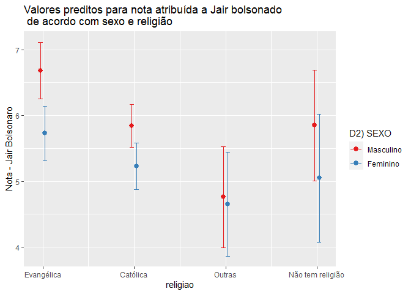

Exercicio 9
================

### Continuaremos com a utilização dos dados do ESEB2018. Carregue o banco da mesma forma que nos exercicios anteriores

``` r
library(tidyverse)
library(haven)
library(scales)
require(sjPlot)
options(scipen = 9999)

link <- "https://github.com/MartinsRodrigo/Analise-de-dados/blob/master/04622.sav?raw=true"

download.file(link, "04622.sav", mode = "wb")

banco <- read_spss("04622.sav") 

banco <- banco %>%
  mutate(D10 = as_factor(D10)) %>%
  filter(Q1607 < 11, 
         Q18 < 11,
         D9 < 9999998,
         Q1501 < 11)
```

### Crie a mesma variável de religião utilizada no exercício anterior

``` r
Outras <- levels(banco$D10)[-c(3,5,13)]

banco <- banco %>%
  mutate(religiao = case_when(D10 %in% Outras ~ "Outras",
                              D10 == "Católica" ~ "Católica",
                              D10 == "Evangélica" ~ "Evangélica",
                              D10 == "Não tem religião" ~ "Não tem religião"))


ggplot(banco, aes(religiao, ..count../sum(..count..) )) +
  geom_bar() +
  scale_y_continuous(labels = percent)
```

<!-- -->

### Faça uma regressão linear avaliando em que medida as variáveis independentes utilizadas nos exercícios 7 e 8, idade(D1A\_ID), educação (D3\_ESCOLA), renda (D9), nota atribuída ao PT (Q1501), auto-atribuição ideológica (Q18), sexo (D2\_SEXO) e religião (variável criada no passo anterior) explicam a avaliação de Bolsonaro (Q1607), mas com uma interação entre as variáveis religião e sexo. Exiba o resultado da regressão e interprete os valores dos coeficientes \(\beta\)s estimados.

#### Em primeiro lugar, o intercepto indica o valor da nota de Bolsonaro no caso em que todas as variáveis independentes são iguais a zero simultaneamente. Esse valor não é relevante para variáveis como idade e renda, mas é especialmente relevante nos casos das variáveis categóricas. Neste modelo o intecepto representa os casos em que os respondentes são do sexo masculino (D2\_SEXO = 0) e católicos (Religiao = 0). O primeiro coeficiente demonstra que o aumento de uma unidade de idade tem impacto de 0.01 na nota atribuída a Bolsonaro. A variável D3\_ESCOLA tem coeficiente de -0.11, indicando uma redução desta magnitude para cada ano adicional de escolaridade. Renda tem um impacto negativo na nota de 0.00003 para cada unidade adicional. A nota atribuída ao PT tem coeficiente de -0.39, demonstrando a relação negativa entre o Partido e Jair Bolsonaro. Por fim, das variáveis isoladas do modelo, a escala ideológica tem impacto de 0,31, ou seja, quando mais conservador o respondente, maior sua nota atribuída a Jair Bolsonaro. Os termos interativos do modelo devem ser avaliados em referência comparando-se os valores base das variáveis. Portanto, o coeficiente isolado da variável D2\_SEXO indica o efeito da variação da categoria base (de homem para mulher) na nota de Bolsonaro, no caso em que religião = 0 (católica). O coeficiente indica que, em média, mulheres católicas atribuem nota menor em 0.611 do que homens católicos. Já os coeficientes da variável religião (isoladamente) representam o efeito da religião quando a variável D2\_SEXO = 0 (homem). Homens evangélicos atribuem nota 1.18 maior a Bolsonaro que homens católicos, homens sem religião 0.19 maior e homens de outras relgiões 1.15 menor. O termo interativo representa a variação simultânea das variáveis D2\_SEXO e religião. Mulheres evangélicas (D2\_SEXO:religiaoEvangélica) atribuem nota 0.34 menor que homens católicos, enquanto mulheres sem religião (D2\_SEXO:religiaoNão tem religião) 0.18 menor e mulheres de outras reliões (D2\_SEXO:religiaoOutras) 0.50 maior.

``` r
summary(
  regressao <- lm(Q1607~D1A_ID +
                  D3_ESCOLA +
                  D9 + Q1501 +
                  Q18 + D2_SEXO +
                  religiao + 
                  D2_SEXO*religiao, data = banco)
        )
```

    ## 
    ## Call:
    ## lm(formula = Q1607 ~ D1A_ID + D3_ESCOLA + D9 + Q1501 + Q18 + 
    ##     D2_SEXO + religiao + D2_SEXO * religiao, data = banco)
    ## 
    ## Residuals:
    ##    Min     1Q Median     3Q    Max 
    ## -8.942 -2.561  0.361  2.303  9.052 
    ## 
    ## Coefficients:
    ##                                     Estimate  Std. Error t value
    ## (Intercept)                       6.11447301  0.59146502  10.338
    ## D1A_ID                            0.01065374  0.00625539   1.703
    ## D3_ESCOLA                        -0.11338330  0.04491403  -2.524
    ## D9                               -0.00003632  0.00002768  -1.312
    ## Q1501                            -0.39564311  0.02369663 -16.696
    ## Q18                               0.31502274  0.02607173  12.083
    ## D2_SEXO                          -0.61147553  0.24379852  -2.508
    ## religiaoEvangélica                1.18072859  0.61461793   1.921
    ## religiaoNão tem religião          0.19859068  1.05853540   0.188
    ## religiaoOutras                   -1.58309059  0.95031319  -1.666
    ## D2_SEXO:religiaoEvangélica       -0.34121012  0.38950878  -0.876
    ## D2_SEXO:religiaoNão tem religião -0.18889941  0.69787901  -0.271
    ## D2_SEXO:religiaoOutras            0.50409816  0.60674166   0.831
    ##                                             Pr(>|t|)    
    ## (Intercept)                      <0.0000000000000002 ***
    ## D1A_ID                                        0.0888 .  
    ## D3_ESCOLA                                     0.0117 *  
    ## D9                                            0.1897    
    ## Q1501                            <0.0000000000000002 ***
    ## Q18                              <0.0000000000000002 ***
    ## D2_SEXO                                       0.0122 *  
    ## religiaoEvangélica                            0.0549 .  
    ## religiaoNão tem religião                      0.8512    
    ## religiaoOutras                                0.0960 .  
    ## D2_SEXO:religiaoEvangélica                    0.3812    
    ## D2_SEXO:religiaoNão tem religião              0.7867    
    ## D2_SEXO:religiaoOutras                        0.4062    
    ## ---
    ## Signif. codes:  0 '***' 0.001 '**' 0.01 '*' 0.05 '.' 0.1 ' ' 1
    ## 
    ## Residual standard error: 3.297 on 1449 degrees of freedom
    ## Multiple R-squared:  0.3028, Adjusted R-squared:  0.297 
    ## F-statistic: 52.44 on 12 and 1449 DF,  p-value: < 0.00000000000000022

### Interprete a significancia estatística dos coeficientes estimados

#### O principal problema em analisar a significância estatística em modelos interativos é que p-valor em questão se refere ao coeficiente nos casos em que as outras variáveis são zero, mas não analisa os outros níveis das variáveis independentes. Portanto, a significância dos coeficientes das variáveis D2\_SEXO, religião e da interação entre as duas apenas pode ser avaliado quando comparado com os valores base da variável, homem e católico.

### Faça um gráfico que mostre a interação entre as duas variáveis. Interprete o resultado apresentado

#### O primeiro resultado eviente através da análise do gráfico dos coeficientes é que a variável D2\_SEXO teve coeficientes próximos para os diferentes níveis da categoria religião. Considerando o intervalo de confiança de 95%, não é possível diferenciar os coeficientes entre homens e mulheres para católicos, sem religiao e de outras religiões. Apenas para os respondentes evangélicos a diferença entre homens e mulheres é significativa, nos outros casos os intervalos de confiança se sobrepõem.

``` r
plot_model(regressao, type = 'pred', terms = c('religiao', 'D2_SEXO'),
           show.intercept = TRUE, title = 'Valores preditos para nota atribuída a Jair bolsonado\n de acordo com sexo e religião', axis.title = 'Nota - Jair Bolsonaro')
```

<!-- -->
